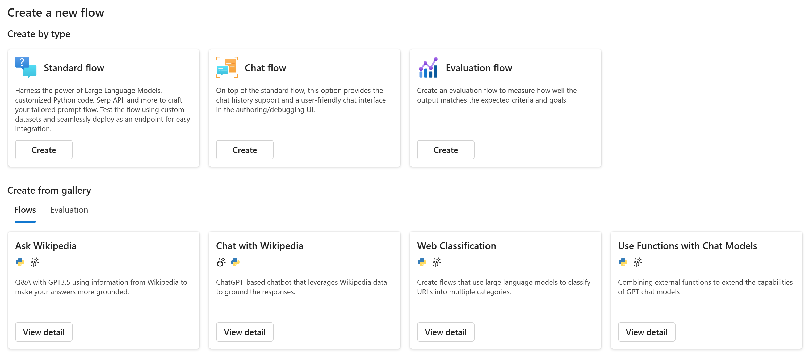
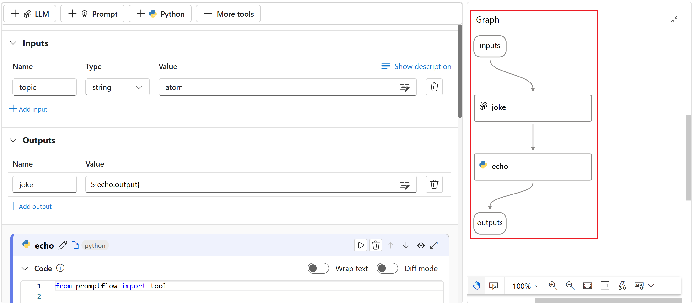
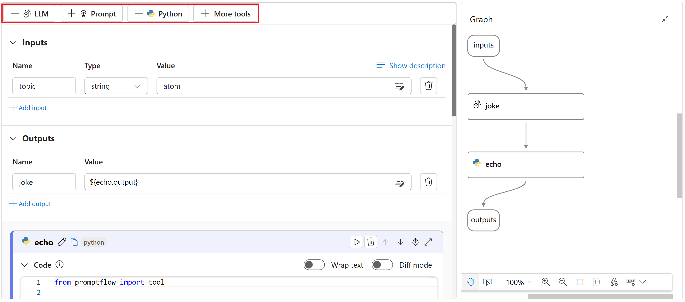

# Lab 01: Comprehend the Flow Development Lifecycle

## Lab scenario
In this lab, you will explore the lifecycle of developing AI applications using Azure AI Studio's Prompt Flow. You'll start by understanding the structured process, including initialization, experimentation, evaluation, refinement, and production stages. You will learn about different flow types, such as Standard, Chat, and Evaluation flows, and how they cater to various application needs. You'll also delve into the concept of flows and nodes within Prompt Flow, which enable seamless data processing and task execution. Finally, you'll initialize a Prompt Flow project in Azure AI Studio, setting up the necessary environment to begin developing, testing, and refining AI applications.

## Lab objectives
In this lab, you will perform the following:
- Task 1: Comprehend the Flow Development Lifecycle
- Task 2: Initialize a Prompt Flow Project
  
### Task 1: Comprehend the Flow Development Lifecycle

Prompt flow offers a well-defined process that facilitates the seamless development of AI applications. By using it, you can effectively progress through the stages of developing, testing, tuning, and deploying flows, ultimately resulting in the creation of fully fledged AI applications.

The lifecycle consists of the following stages:

- Initialization: Identify the business use case, collect sample data, learn to build a basic prompt, and develop a flow that extends its capabilities.
Experimentation: Run the flow against sample data, evaluate the prompt's performance, and iterate on the flow if necessary. Continuously experiment until satisfied with the results.
- Evaluation and refinement: Assess the flow's performance by running it against a larger dataset, evaluate the prompt's effectiveness, and refine as needed. Proceed to the next stage if the results meet the desired criteria.
- Production: Optimize the flow for efficiency and effectiveness, deploy it, monitor performance in a production environment, and gather usage data and feedback. Use this information to improve the flow and contribute to earlier stages for further iterations.
- By following this structured and methodical approach, prompt flow empowers you to develop, rigorously test, fine-tune, and deploy flows with confidence, resulting in the creation of robust and sophisticated AI applications.

### Flow types

In Azure AI Studio, you can start a new flow by selecting a flow type or a template from the gallery.

- **Standard flow**: Designed for general application development, the standard flow allows you to create a flow using a wide range of built-in tools for developing LLM-based applications. It provides flexibility and versatility for developing applications across different domains.
- **Chat flow**: Tailored for conversational application development, the Chat flow builds upon the capabilities of the standard flow and provides enhanced support for chat inputs/outputs and chat history management. With native conversation mode and built-in features, you can seamlessly develop and debug their applications within a conversational context.
- **Evaluation flow**: Designed for evaluation scenarios, the evaluation flow enables you to create a flow that takes the outputs of previous flow runs as inputs. This flow type allows you to evaluate the performance of previous run results and output relevant metrics, facilitating the assessment and improvement of their models or applications.

### Flows
A flow in Prompt flow serves as an executable workflow that streamlines the development of your LLM-based AI application. It provides a comprehensive framework for managing data flow and processing within your application.

Within a flow, nodes take center stage, representing specific tools with unique capabilities. These nodes handle data processing, task execution, and algorithmic operations, with inputs and outputs. By connecting nodes, you establish a seamless chain of operations that guides the flow of data through your application.

To facilitate node configuration and fine-tuning, a visual representation of the workflow structure is provided through a DAG (Directed Acyclic Graph) graph. This graph showcases the connectivity and dependencies between nodes, providing a clear overview of the entire workflow.

### Prompt flow tools
Tools are the fundamental building blocks of a flow.

Each tool is a simple, executable unit with a specific function. By combining different tools, you can create a flow that accomplishes a wide range of goals. For example, you can use the LLM tool to generate text or summarize an article and the Python tool to process the text to inform the next flow component or result.

One of the key benefit of Prompt flow tools is their seamless integration with third-party APIs and python open source packages. This not only improves the functionality of large language models but also makes the development process more efficient for developers.

## Task 2: Initialize a Prompt Flow Project

1. Open a new tab, and navigate to the [Azure AI Studio](https://ai.azure.com/?tid=f9733b59-6ed1-4cb1-a5c4-55f5c0d6ad6f).

1. On the **Azure AI Studio**, on the home page, select **+ New Project**.

   

1. On the **Create a project** page, and follow these instructions to fill out the properties:

   - Project name: **Modelproject-<inject key="DeploymentID" enableCopy="false"/>**
   - Hub: Create a new hub
   - Select **Next**.
   - Hub name: **modelhub<inject key="DeploymentID" enableCopy="false"/>**
   - Subscription: Set as default
   - Resource group: **ODL-MEMT-<inject key="DeploymentID" enableCopy="false"/>**
   - Location: **<inject key="Region" enableCopy="false"/>**
   - Connect Azure AI Services or Azure OpenAI: Keep it as default
   - Connect Azure AI Search: Keep it as default
   - Select **Next**

1. On the **Review and finish** page, select **Create a Project**.

1. You see progress of resource creation and the project is created when the process is complete. Once a project is created, you can access the playground, tools, and other assets in the left navigation panel.

## Review
In this lab you have completed the following tasks:
- Comprehended the Flow Development Lifecycle
- Initialized a Prompt Flow Project
