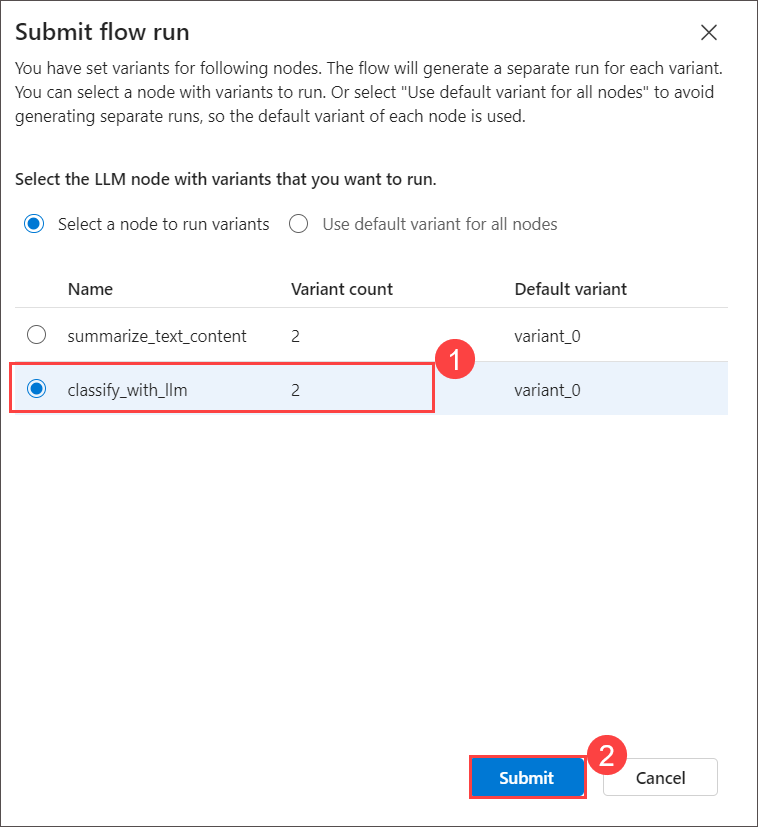

# Fine-Tuning the Model 

## Task 1: Perform Iterative Prompt Tuning and Variant Comparison 

1. On the [Azure AI Studio](https://ai.azure.com/?tid=f9733b59-6ed1-4cb1-a5c4-55f5c0d6ad6f), under **Tools** section select **Prompt flow**.

1. Select **+ Create** to open the flow creation wizard.

1. In the **Create a new flow** under **Explore gallery** in the **Web Classification** box select **Clone**.

     

1. On the **Clone Flow** page, enter name Web Classification-<inject key="DeploymentID" enableCopy="false"/> and click on **Clone**.

      

1. Scroll down to **classify_with_llm** node and Select the following 

     Connection : 

     deployment_name : 
   
1. Replace the existing prompt with the following prompt as a baseline prompt in the classify_with_llm node.

   ```
   system:
   Your task is to classify a given URL into one of the following types:
   Movie, App, Academic, Channel, Profile, PDF, or None based on the text content information.
   The classification will be based on the URL, the webpage text content summary, or both.

   user:
   For a given URL: https://www.youtube.com/channel/UC_x5XG1OV2P6uZZ5FSM9Ttw, and text content: NFL Sunday Ticket is a service offered by Google LLC that allows users to watch NFL games 
   on YouTube. It is available in 2023 and is subject to the terms and privacy policy of Google LLC. It is also subject to YouTube's terms of use and any applicable laws.
   Classify the above URL to complete the category and indicate evidence.
   
   ```

1. Select Show variants button on the top right of the LLM node. The existing LLM node is variant_0 and is the default variant.
1. Select the **Clone** button on variant_0 to generate variant_1, then we can configure parameters to different values on variant_1
1. On the variant_1 replace the existing prompt with the following prompt:

  ```  
  system:  
  Your task is to classify a given URL into one of the following types:
  Movie, App, Academic, Channel, Profile, PDF, or None based on the text content information.
  The classification will be based on the URL, the webpage text content summary, or both.

  user:
  For a given URL: https://play.google.com/store/apps/details?id=com.spotify.music, and text content: Spotify is a free music and podcast streaming app with millions of songs, albums, 
  and original podcasts. It also offers audiobooks, so users can enjoy thousands of stories. It has a variety of features such as creating and sharing music playlists, discovering new 
  music, and listening to popular and exclusive podcasts. It also has a Premium subscription option which allows users to download and listen offline, and access ad-free music. It is 
  available on all devices and has a variety of genres and artists to choose from.
  Classify the above URL to complete the category and indicate evidence.

  ```

1. Select Hide variants to stop adding more variants. All variants are folded. The default variant is shown for the node. For classify_with_llm node, based on variant_0:

1. Scroll up to **summarize_text_content** node and Select the following 

     Connection : 

     deployment_name : 

1. Replace the existing prompt with the following prompt as a baseline prompt in summarize_text_content node, based on variant_0, you can create variant_1.  
     
   ```  
   system:
   Please summarize the following text in one paragraph. 100 words.
   Do not add any information that is not in the text.

   user:
   Text: The history of the internet dates back to the early 1960s, when the idea of a global network of computers was first proposed. In the late 1960s, the Advanced Research Projects 
   Agency Network (ARPANET) was developed by the United States Department of Defense. It was the first operational packet-switching network and the precursor to the modern internet. The 
   1970s and 1980s saw the development of various protocols and standards, such as TCP/IP, which allowed different networks to communicate with each other. In the 1990s, the invention 
   of the World Wide Web by Tim Berners-Lee revolutionized the internet, making it accessible to the general public. Since then, the internet has grown exponentially, becoming an 
   integral part of daily life for billions of people around the world.

   assistant:
   Summary:
   ```

1. Select Show variants button on the top right of the LLM node. The existing LLM node is variant_0 and is the default variant.
1. Select the **Clone** button on variant_0 to generate variant_1, then we can configure parameters to different values on variant_1
1. On the variant_1 replace the existing prompt with the following prompt:

   ```
   system:
   Please summarize the following text in one paragraph. 100 words.
   Do not add any information that is not in the text.

   user:
   Text: Artificial intelligence (AI) refers to the simulation of human intelligence in machines that are programmed to think and learn. AI has various applications in today's society, 
   including robotics, natural language processing, and decision-making systems. AI can be categorized into narrow AI, which is designed for specific tasks, and general AI, which can 
   perform any intellectual task that a human can. Despite its benefits, AI also poses ethical concerns, such as privacy invasion and job displacement.

   assistant:
   Summary:

   ```
1. Select **Save** button from top menu and click on **Start Compute session running** 
1. Select the Run button on the top right.
1. On the Submit flow run window open under **Select the LLM node with variants that you wnat to run** choose **Select a node to run variants** then select **summarize_text_content** 
   and click on **Submit**. 

   
   
1. Once session runned successfully review the output by select each variant.

1. In top menu select **Variant 0 (1)** from the drop down and select **view full output**

   

1. Review the output  

   


1. Select the Run button on the top right.
1. On the Submit flow run window open under **Select the LLM node with variants that you wnat to run** choose **Select a node to run variants** then select **** 
   and click on **Submit**. 

    

1. Once session runned successfully review the output by select each variant.

1. In top menu select **Variant 0 (1)** from the drop down and select **view full output**

1. Review the output.  

## Task 2: Optimize Flow Performance for Production 

No content found yet
