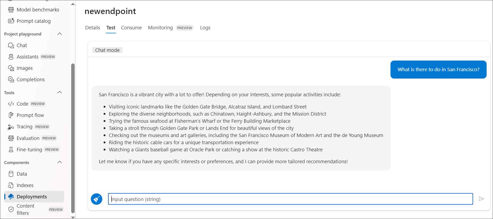
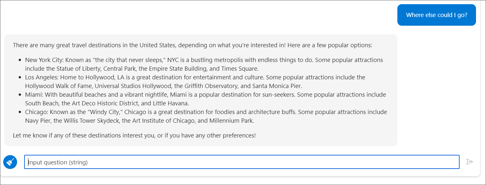

# Implementing Chat Flow and Tool Integration 

## Task 1: Design and Implement a Chat Flow

1. In the Chat playground, select Prompt flow from the top bar.
1. Enter Travel-Chat as folder name.

1. A simple chat flow is created for you. Note there are two inputs (chat history and the user’s question), an LLM node that will connect with your deployed language model, and an output to reflect the response in the chat.

1. To be able to test your flow, you need compute.

1. Select Start compute session from the top bar.
1. The compute session will take 1-3 minutes to start.
1. Find the LLM node named chat. Note that the prompt already includes the system prompt you specified in the chat playground.

1. You still need to connect the LLM node to your deployed model.

1. In the LLM node section, for Connection, select the connection that was created for you when you created the AI hub.
1. For Api, select chat.
1. For deployment_name, select the gpt-35-turbo model you deployed.
1. For response_format, select {“type”:”text”}.
1. Review the prompt field and ensure it looks like the following:
   
## Task 2: Use LLM and Prompt Tools in Flows

Now that you’ve developed the flow, you can use the chat window to test the flow.

1. Ensure the compute session is running.
    - Select Save.

1. Select Chat to test the flow.

1. Enter the query: **I have one day in London, what should I do?** and review the output.

1. When you’re satisfied with the behavior of the flow you created, you can deploy the flow.

1. Select Deploy to deploy the flow with the following settings:
    Basic settings:
     - Endpoint: New
     - Endpoint name: Enter a unique name
     - Deployment name: Enter a unique name
     - Virtual machine: Standard_DS3_v2
     - Instance count: 3
     - Inferencing data collection: Enabled

   Advanced settings:
     - Use the default settings

1. In Azure AI Studio, in your project, in the navigation pane on the left, under Components, select the Deployments page.

1. Note that by default the Model deployments are listed, including your deployed language model.

1. Select the App deployments tab to find your deployed flow. It may take some time before the deployment is listed and successfully created.

1. When the deployment has succeeded, select it. Then, on its Test page, enter the prompt **What is there to do in San Francisco?** and review the response.

     

1. Enter the prompt **Where else could I go?** and review the response.

     

1. View the Consume page for the endpoint, and note that it contains connection information and sample code that you can use to build a client application for your endpoint - enabling you to integrate the prompt flow solution into an application as a custom copilot.
