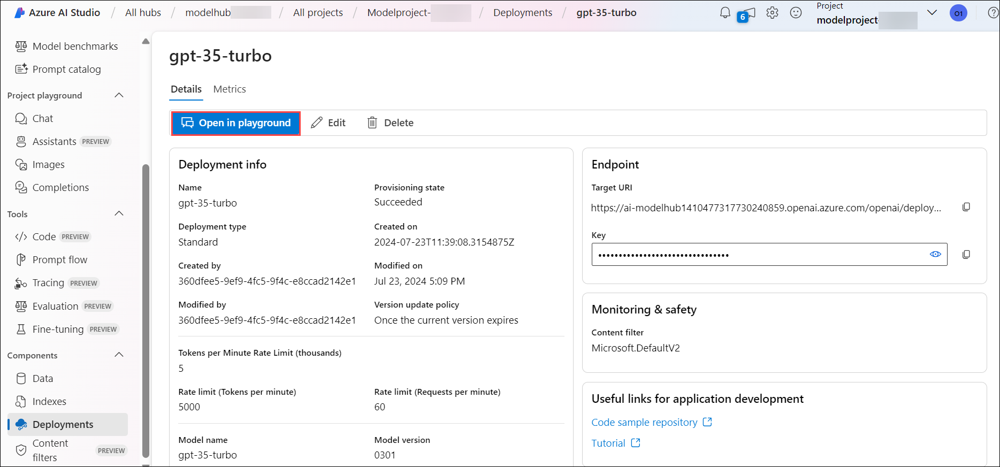
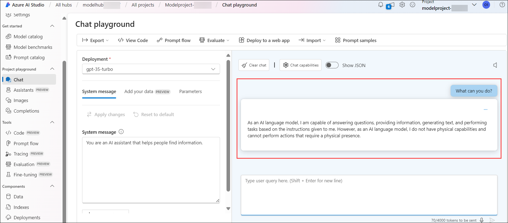
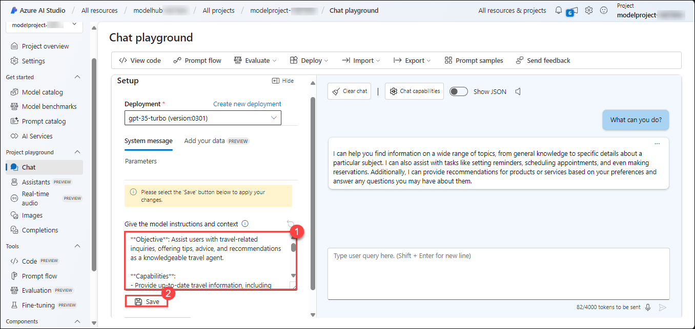
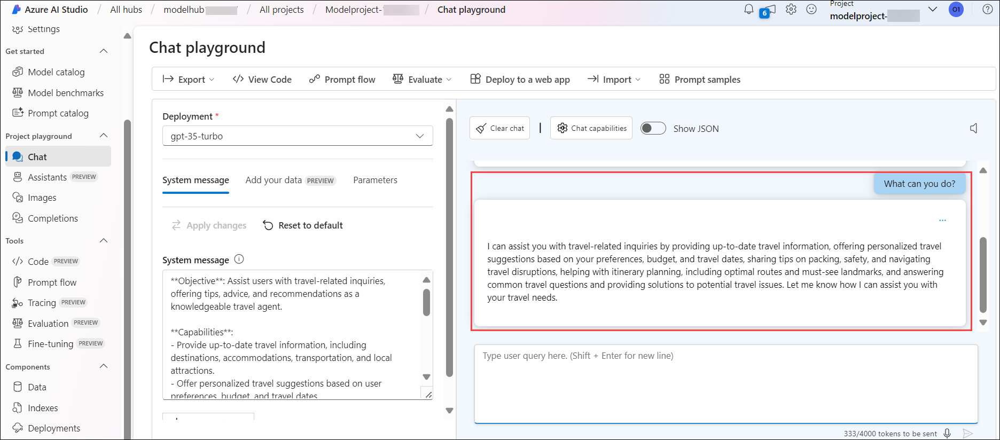
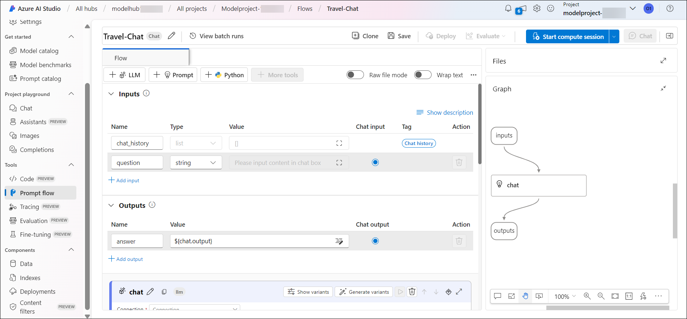
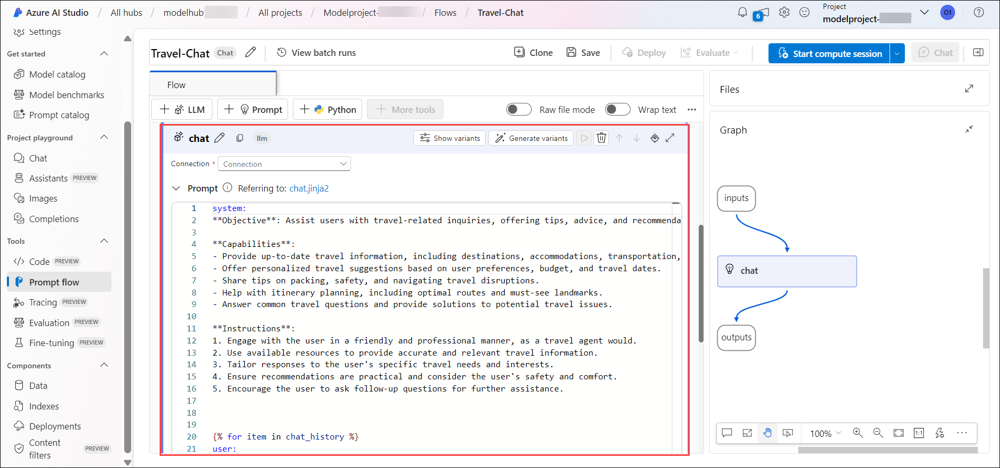
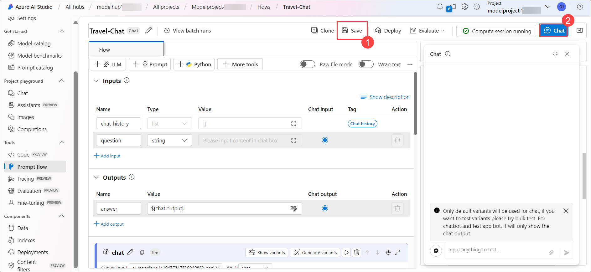
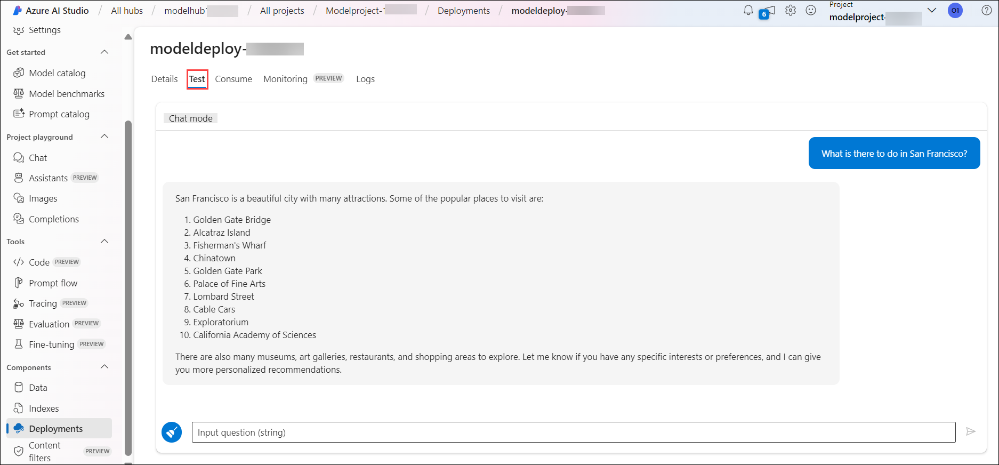
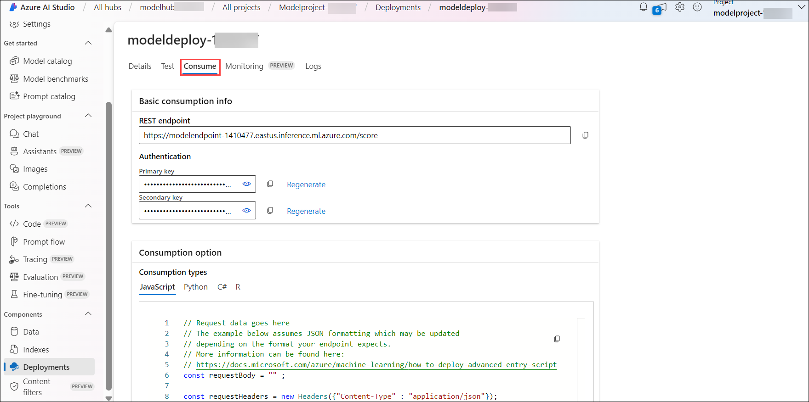

# Lab 05: Implementing Chat Flow and Tool Integration

## Lab scenario
In this lab, you will be designing and implementing a chat flow to interact with a deployed language model. You'll start by creating a basic chat flow using Azure AI Studio, which includes integrating inputs, an LLM node, and configuring the output to reflect chat responses. You will then test the chat flow, ensure it functions correctly, and deploy it to a production environment. The final steps involve verifying the deployment, testing the deployed flow with sample queries, and exploring options for integrating the chat flow into applications as a custom copilot.

## Lab objectives
In this lab, you will perform the following:
- Task 1: Design and Implement a Chat Flow
- Task 2: Use LLM and Prompt Tools in Flows

## Task 1: Design and Implement a Chat Flow
Design and implement a chat flow using Azure AI Studio to interact with a deployed language model, test its functionality, and deploy it for production use.

1. On the [Azure AI Studio](https://ai.azure.com/?tid=f9733b59-6ed1-4cb1-a5c4-55f5c0d6ad6f), under **Components**, select **Deployments (1)**. On the **Model deployments** page select **gpt-35-turbo (2)**.

   .png)

1. On the **gpt-35-turbo** page, select **Open in playground**, under **Details** tab.

   

1. In the chat window, enter the query **What can you do?**.

   >**Note:** The answer is generic because there are no specific instructions for the assistant. To make it focused on a task, you can change the system prompt.

   

1. Update the **System message (1)** to the following:-

   ```
   **Objective**: Assist users with travel-related inquiries, offering tips, advice, and recommendations as a knowledgeable travel agent.

   **Capabilities**:
   - Provide up-to-date travel information, including destinations, accommodations, transportation, and local attractions.
   - Offer personalized travel suggestions based on user preferences, budget, and travel dates.
   - Share tips on packing, safety, and navigating travel disruptions.
   - Help with itinerary planning, including optimal routes and must-see landmarks.
   - Answer common travel questions and provide solutions to potential travel issues.
    
   **Instructions**:
   1. Engage with the user in a friendly and professional manner, as a travel agent would.
   2. Use available resources to provide accurate and relevant travel information.
   3. Tailor responses to the user's specific travel needs and interests.
   4. Ensure recommendations are practical and consider the user's safety and comfort.
   5. Encourage the user to ask follow-up questions for further assistance.

   ```
   
1. Select **Apply changes (2)**, and select **continue**.

   

1. In the chat window, enter the same query as before: **What can you do?**. Note the change in response.

   

1. Under the Chat playground, select **Prompt flow** from the top bar. Enter **Travel-Chat** as folder name, and select **Open**.

   .png)

1. A simple chat flow is created for you. Note there are two inputs (chat history and the user’s question), an LLM node that will connect with your deployed language model, and an output to reflect the response in the chat.

   

1. To be able to test your flow, you need compute. Select **Start compute session** from the top bar.

   
   
   >**Note:** The compute session will take 1-3 minutes to start.
   
1. Select the LLM node named **chat**. Note that the prompt already includes the system prompt you specified in the chat playground.

   

1. You still need to connect the LLM node to your deployed model. In the LLM node section, for **Connection**, select the connection that was created for you when you created the AI hub. For **Api**, select **chat**. For **deployment_name**, select the **gpt-35-turbo** model you deployed. For **response_format**, select **{“type”:”text”}**.

   .png)

1. Review the prompt field and ensure it looks like the following:

   ```
   system:
   **Objective**: Assist users with travel-related inquiries, offering tips, advice, and recommendations as a knowledgeable travel agent.
   
   **Capabilities**:
   - Provide up-to-date travel information, including destinations, accommodations, transportation, and local attractions.
   - Offer personalized travel suggestions based on user preferences, budget, and travel dates.
   - Share tips on packing, safety, and navigating travel disruptions.
   - Help with itinerary planning, including optimal routes and must-see landmarks.
   - Answer common travel questions and provide solutions to potential travel issues.
   
   **Instructions**:
   1. Engage with the user in a friendly and professional manner, as a travel agent would.
   2. Use available resources to provide accurate and relevant travel information.
   3. Tailor responses to the user's specific travel needs and interests.
   4. Ensure recommendations are practical and consider the user's safety and comfort.
   5. Encourage the user to ask follow-up questions for further assistance.
   
   
   user:
   {{item.inputs.question}}
   assistant:
   {{item.outputs.answer}}
   
   
   user:
   {{question}}
   ```
   
## Task 2: Use LLM and Prompt Tools in Flows

Now that you’ve developed the flow, you can use the chat window to test the flow.

1. Ensure the compute session is running. Select **Save (1)**. Select **Chat (2)** to test the flow.

   

1. Enter the query: **I have one day in London, what should I do?** and review the output.

1. Select **Deploy** to deploy the flow with the following settings:

   - Basic settings:
     - Endpoint: New
     - Endpoint name: **modelendpoint-<inject key="DeploymentID" enableCopy="false"/>**
     - Deployment name: **modeldeploy-<inject key="DeploymentID" enableCopy="false"/>**
     - Virtual machine: **Standard_DS3_v2**
     - Instance count: **3**
     - Inferencing data collection: **Enabled**
     - Select **Review + Create**
     - Select **Create**

1. In Azure AI Studio, from the left navigation pane, under **Components**, select the **Deployments**.

   >**Note:** Select **Save** if your flow is not saved.

1. Select the **Model deployments** tab to find your deployed flow. It may take some time before the deployment is listed and successfully created. When the deployment has succeeded, select the newly created deployment.

   .png)

1. Then, on its **Test** page, enter the prompt **What is there to do in San Francisco?** and review the response.

     

1. Enter the prompt **Where else could I go?** and review the response.

     

1. View the **Consume** page for the endpoint, and note that it contains connection information and sample code that you can use to build a client application for your endpoint - enabling you to integrate the prompt flow solution into an application as a custom copilot.

   

## Review
In this lab you have completed the following tasks:
- Designed and Implement a Chat Flow
- Used LLM and Prompt Tools in Flows

### You have successfully completed the lab. Click on **Next >>** to procced with next exercise.
