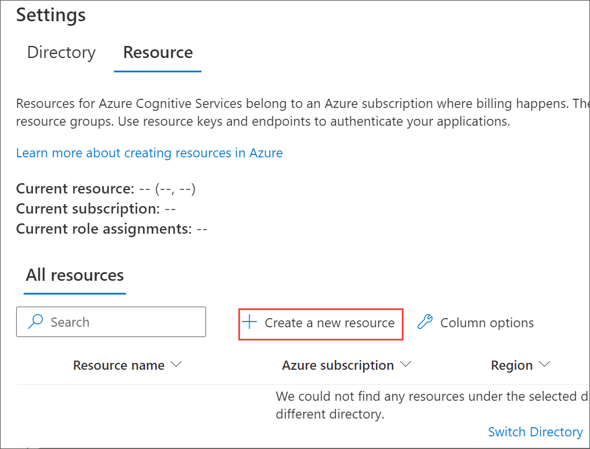
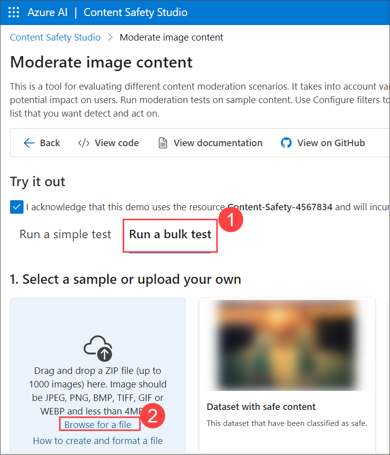
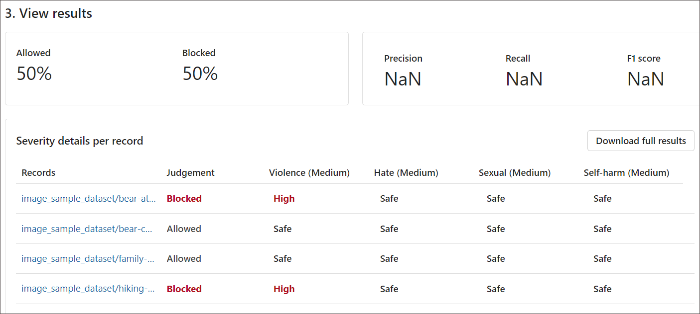

# Ensuring Responsible AI with Content Safety Studio 

The Content Safety Resource is an Azure AI service. This service consists of machine learning assisted moderation APIs which detect material that is potentially offensive, risky, or otherwise undesirable, to assure the contents in community is safe. Follow the steps below to create a Content Safety Resource.

## Task 1: Implement Content Safety Measures

1. Open a new tab, and navigate to the [Content Safety Studio](https://contentsafety.cognitive.azure.com/), select the **Settings** icon in the top navigation menu.

   

1. In the All resources section, select **+ Create a new resource**.

    

1. You will be directed to the **Azure portal**, and on the **Create Content Safety** page, specify the following and click on **Review + Create**.

   - Subscription – select your **Azure subscription**

   - Resource group – select the Resource Group **ODL-MEMT-<inject key="DeploymentID" enableCopy="false"/>**
  
   - Region – **East US**

   - Name – **Content-Safety-<inject key="DeploymentID" enableCopy="false"/>**

   - Pricing tier – Free

     

1. Review the settings and click **Create**.

     

1. Open a new tab, and navigate to the [Content Safety Studio](https://contentsafety.cognitive.azure.com/), select the **Settings** icon in the top navigation menu.

    

1. Make sure Content Safety resources is created.

      

## Task 2: Monitor and Analyze Content for Compliance

   
1. On **Azure AI | Content Safety Studio** under **Safeguard your image content with built-in-features**, select **Moderate image content**.

     

1. On **Moderate image content** select **Run a bulk test** tab then click on **Browse for a file**.

     

1. Within file explorer select and open **image_sample_dataset.zip**.

     

1. Under Test section review **Dataset preview** then select **Configure filters** tab review **Category** and **Threshold level** then click on **Run test**.

     

1. Review the result.

   

   
       
