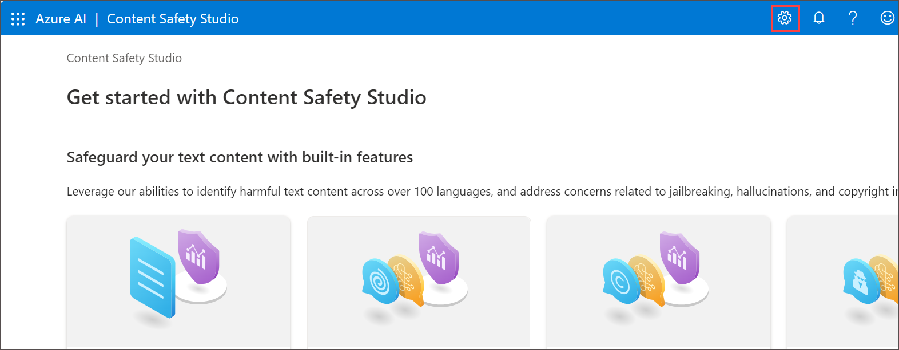
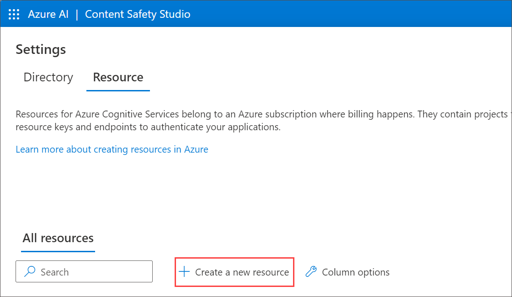
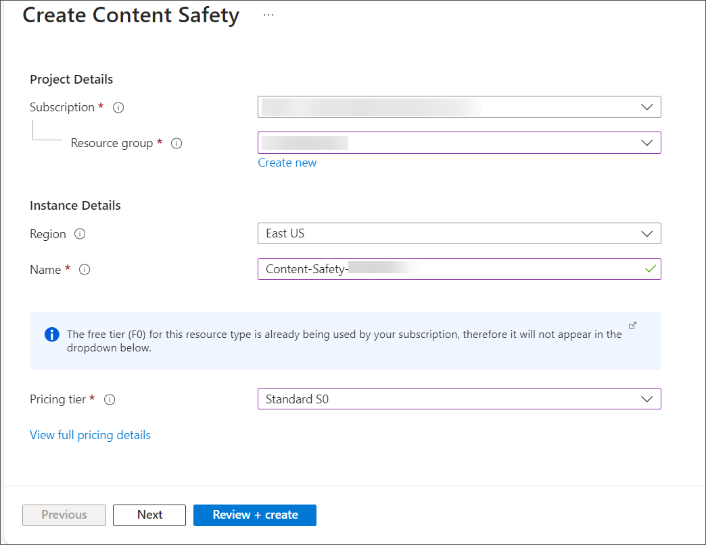

# Ensuring Responsible AI with Content Safety Studio 

The Content Safety Resource is an Azure AI service. This service consists of machine learning assisted moderation APIs which detect material that is potentially offensive, risky, or otherwise undesirable, to assure the contents in community is safe. Follow the steps below to create a Content Safety Resource.

## Task 1: Implement Content Safety Measures

1. Within [Content Safety Studio](https://contentsafety.cognitive.azure.com/), select the Settings icon in the top navigation menu.

   

1. In the All resources section, select + Create a new resource.

    

1. Complete the following fields:

   -  Subscription – select your Azure subscription that has access to Azure OpenAI Service

   -  Resource group – select the Resource Group that was previously created
  
   - Region – East US

   - Name – provide name for your resource

   - Pricing tier – Free or Standard S0

   - Click Review + create.

   - Click Create.

   

## Task 2: Monitor and Analyze Content for Compliance

1. On **Azure AI | Content Safety Studio** under **Safeguard your image content with built-in-features**, select **Moderate image content**.

     

1. On **Moderate image content** select **Run a bulk test** tab then click on **Browse for a file**.

     

1. Within file explorer select and open **image_sample_dataset.zip**.

     

1. Under Test section review **Dataset preview** then select **Configure filters** tab review **Category** and **Threshold level** then click on **Run test**.

     

1. Review the result.

   
       
