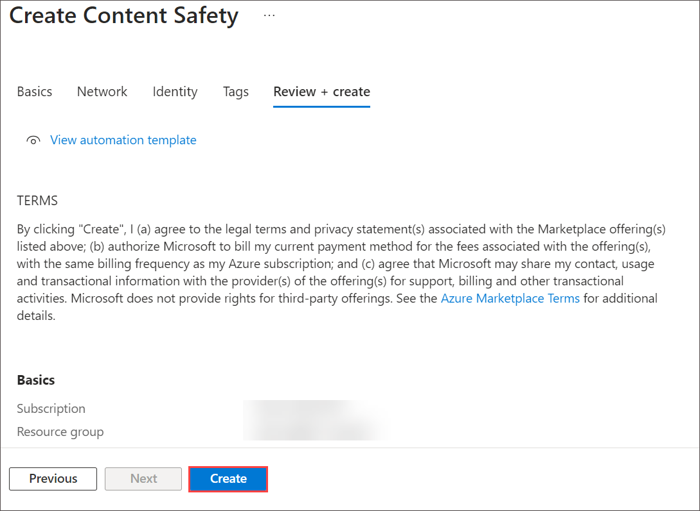
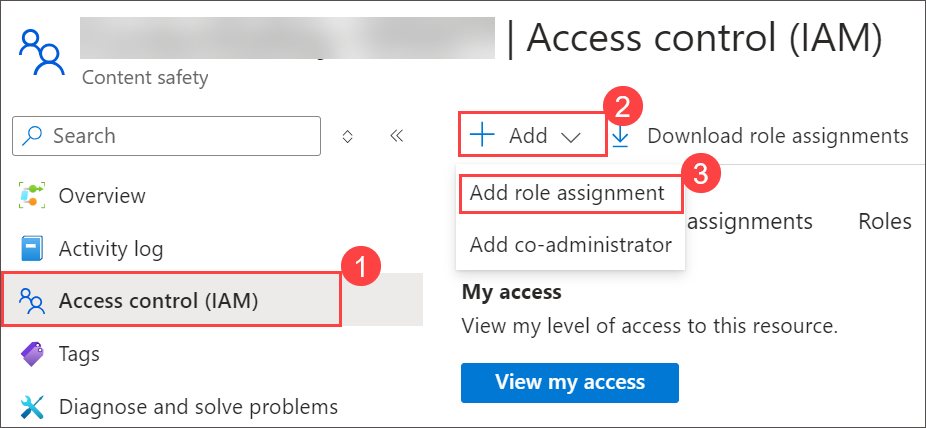
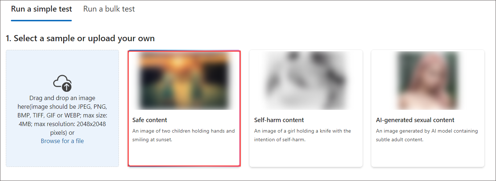
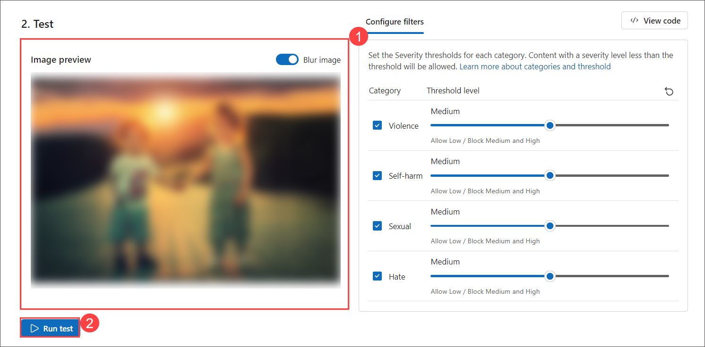
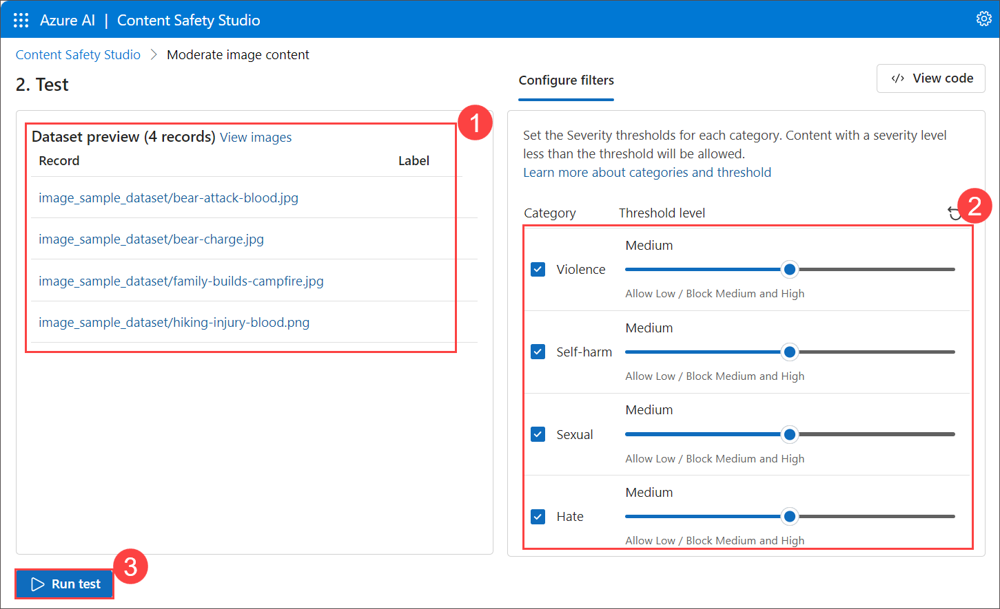

# Ensuring Responsible AI with Content Safety Studio 

The Content Safety Resource is an Azure AI service. This service consists of machine learning assisted moderation APIs which detect material that is potentially offensive, risky, or otherwise undesirable, to assure the contents in community is safe. Follow the steps below to create a Content Safety Resource.

## Task 1: Implement Content Safety Measures

1. Open a new tab, and navigate to the [Content Safety Studio](https://contentsafety.cognitive.azure.com/), select the **Settings** icon in the top navigation menu.

   

1. In the All resources section, select **+ Create a new resource**.

    

1. You will be directed to the **Azure portal**, and on the **Create Content Safety** page, specify the following and click on **Review + Create**.

   - Subscription – select your **Azure subscription**

   - Resource group – select the Resource Group **ODL-MEMT-<inject key="DeploymentID" enableCopy="false"/>**
  
   - Region – **East US**

   - Name – **Content-Safety-<inject key="DeploymentID" enableCopy="false"/>**

   - Pricing tier – Free

     

1. Review the settings and click **Create**.

     

1. Once deployement is successful click on **Go to resource**.

    

1. On **Content-Safety-<inject key="DeploymentID" enableCopy="false"/>** page from the left navigation pane, select  **Access Control (IAM) (1)** > **+ Add (2)** then choose **Add Role assignment (3)**

   

1. On **Add role assignment** page search and select  **Cognitive Services User** then click on **Next**.

1. On **Member** tab, make sure **User, group, or service principal** is selected then click on **+ Select members**  and search  then click **Select** 

1. Click on **Next** > **Review + assign**.

1. Back on **Content-Safety-<inject key="DeploymentID" enableCopy="false"/>** page,  from the left navigation pane, select  **Overview** and review the settings then click on Content Safety Studio link.

     
   
1. Your navigated to the [Content Safety Studio](https://contentsafety.cognitive.azure.com/), select the **Settings** icon in the top navigation menu.

    

1. Make sure Content Safety resources is created.

      

1. Select **Content-Safety-<inject key="DeploymentID" enableCopy="false"/>** and click on **Use resource**.

     .png)
   
## Task 2: Monitor and Analyze Content for Compliance

## Task 2. 1 : Moderate image content for singular isolated images.

1. On **Azure AI | Content Safety Studio** under **Safeguard your image content with built-in-features**, select **Moderate image content**.

     

1. On **Moderate image content** select **Run a simple test** tab, review the options note we have three set content  **Safe content**, **self- harm content** and **AI-generated sexual content**.

1. Simply by selecting any of the content we can use smaple image to test.

     

1. Review the image and click on **Run test**.

     

    > **Note**: The image used for testing contains a graphic detection of a bear attack. The image will be blurred by default in the Image preview. However, you’re welcome to use the Blur image toggle to change this setting.
   
1. Review the result and in same way we can test for rest content.

   

1. Now lets use our image and test then check the result. **Moderate image content** select **Run a simple test** tab then click on **Browse for a file**

    

1. Within **file explorer** select and open **family-builds-campfire.jpg**

1. Review the image and click on **Run test**.

   
   
1. Review the result. As expected, this image content is Allowed, and the Severity level is Safe across all categories. 

   

So far, we’ve tested image content for singular isolated images. However, if we have a bulk dataset of image content, we could test the bulk dataset at once and receive metrics based on the model’s performance.

### Task 2. 2: Run a bulk test

So far, we’ve tested image content for singular isolated images. However, if we have a bulk dataset of image content, we could test the bulk dataset at once and receive metrics based on the model’s performance.

1. On **Moderate image content** select **Run a bulk test** tab then click on **Browse for a file**.

     

1. Within file explorer select and open **image_sample_dataset.zip**.

     

1. Under Test section review **Dataset preview** then select **Configure filters** tab review **Category** and **Threshold level** then click on **Run test**.

     

1. Review the result.

   

   
       
