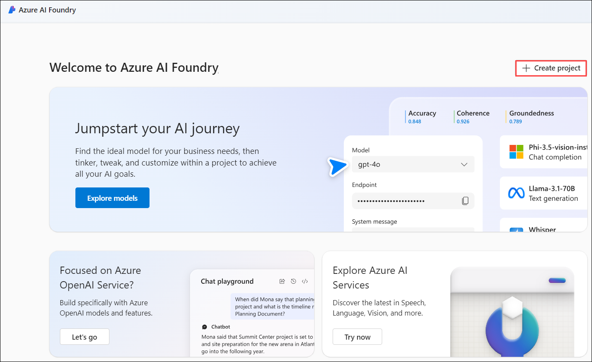
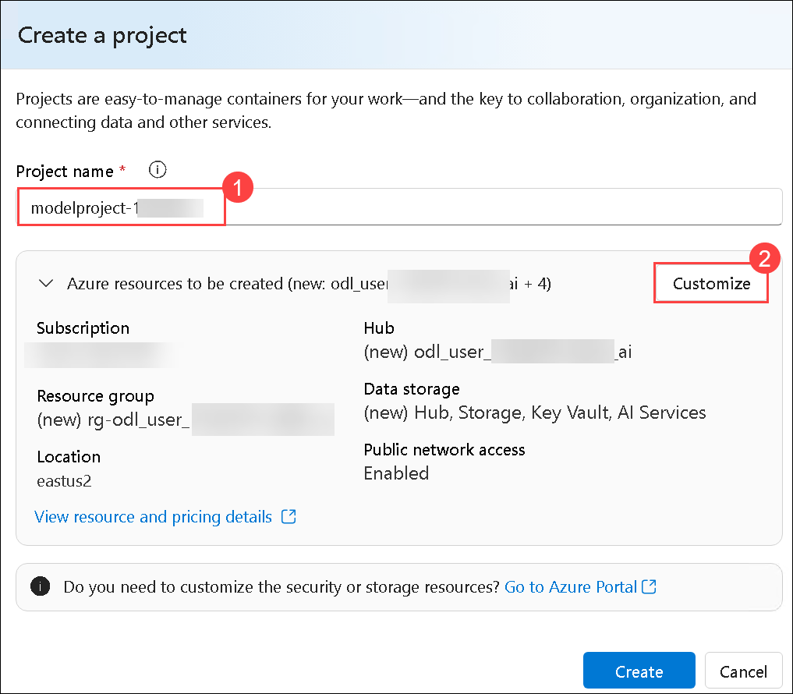
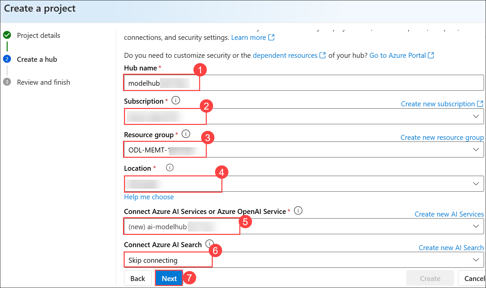
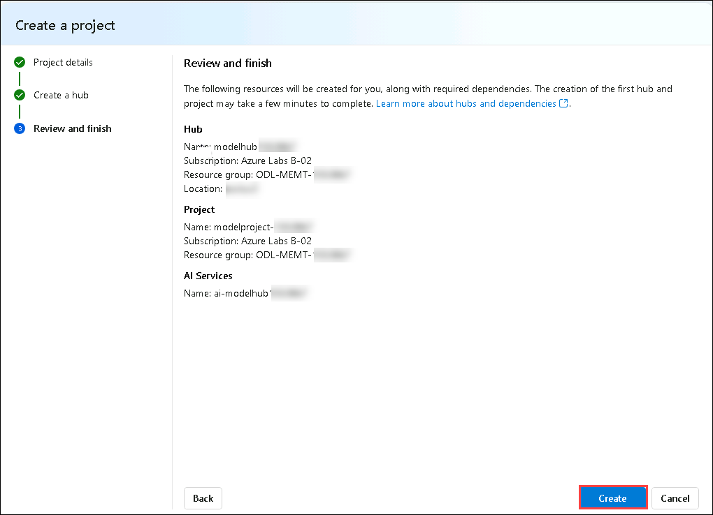
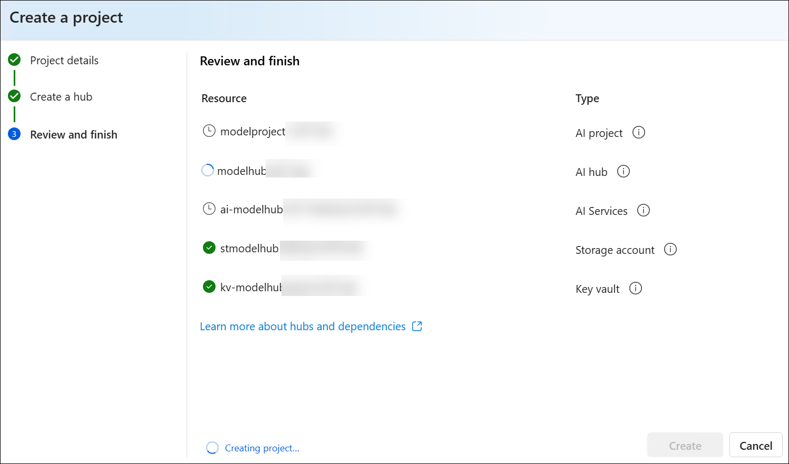
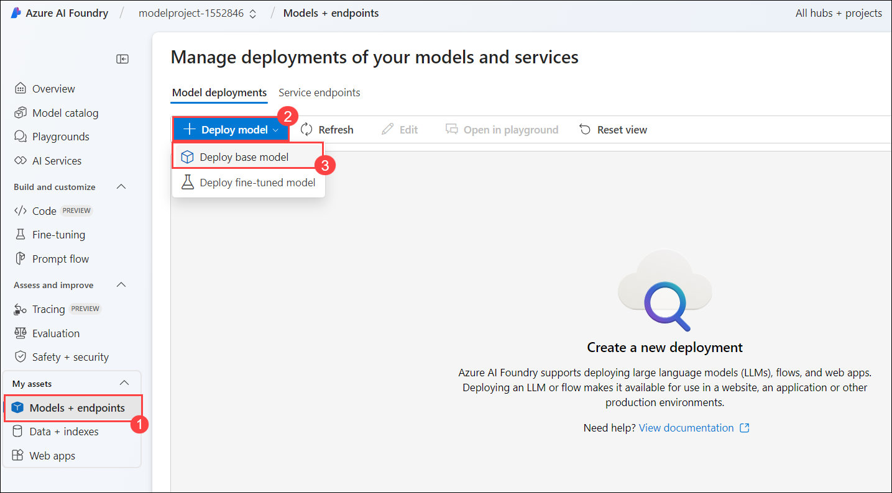
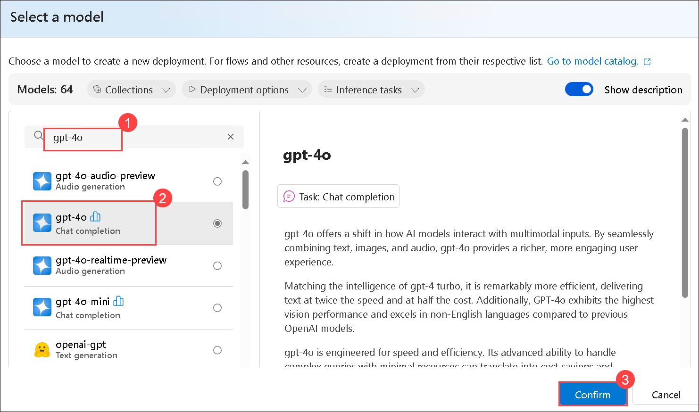
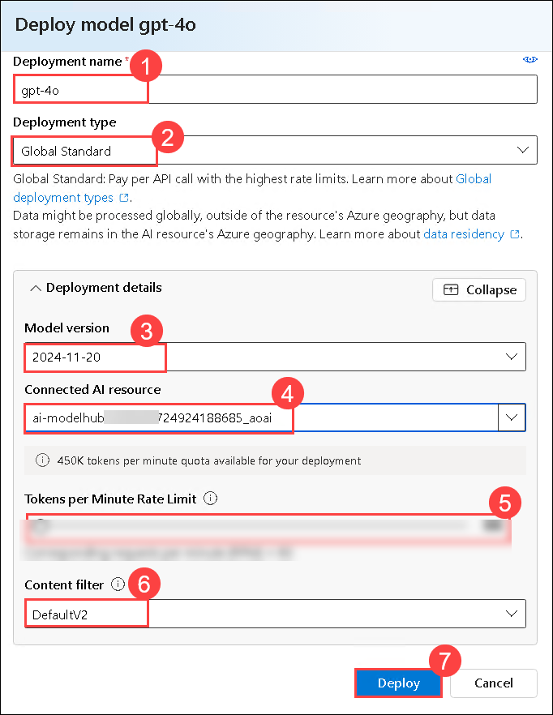
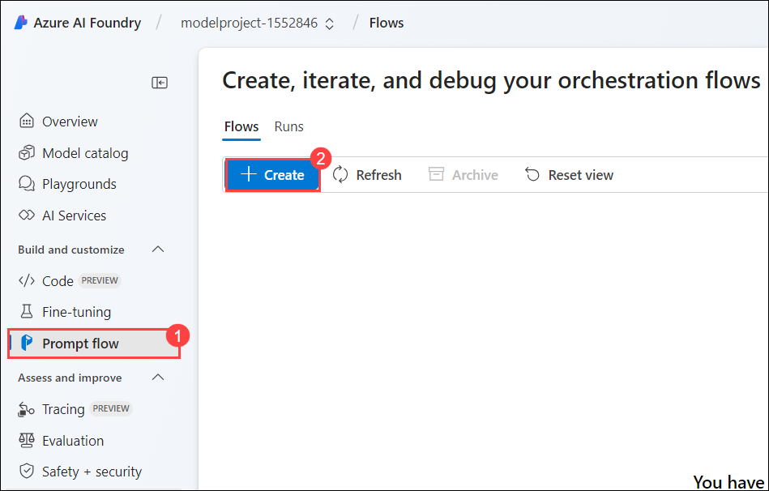
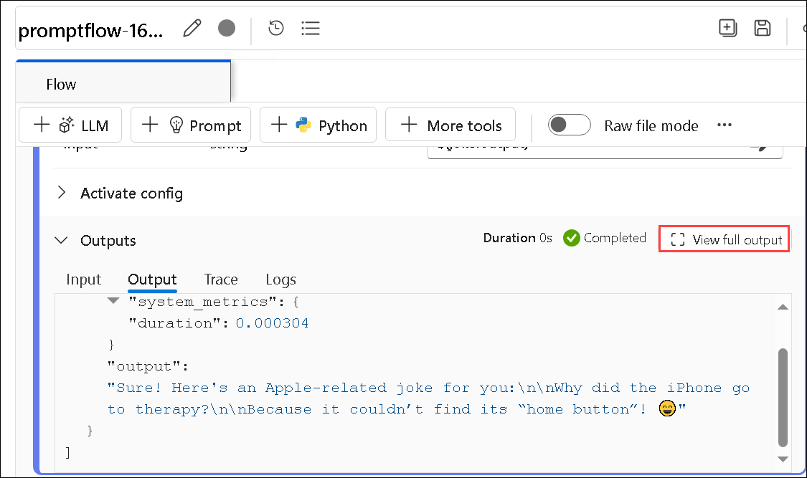

# Lab 02: Building and Customizing Prompt Flows

## Estimated Duration: 60 minutes

## Lab Overview

In this lab, you will gain hands-on experience in initializing a Prompt Flow project in Azure AI foundry, setting up the necessary environment to begin developing, testing, and refining AI applications. You will create and customize prompts within Azure AI foundry's Prompt Flow. Starting with the creation of a new flow, you will add and configure the Prompt tool and develop a flow incorporating LLM (Large Language Model) and Prompt tools. By authoring a sample flow and running it with custom inputs, you'll learn how to monitor flow execution and evaluate outputs, thereby understanding the practical steps involved in developing, testing, and refining AI-driven workflows.

## Lab Objectives
In this lab, you will perform the following:

- Task 1 : Initialize a Prompt Flow Project
- Task 2 : Create and Customize Prompts
- Task 3 : Develop a Flow with LLM and Prompt Tools


## Task 1: Initialize a Prompt Flow Project

In this task, you will set up a structured environment to manage and streamline prompt-based AI tasks. This involves creating a project directory, configuring essential files and dependencies, and establishing a workflow for designing, testing, and refining prompts. Organizing prompts, data, and evaluation metrics in one place ensures consistency and efficiency, helping you optimize prompt performance and achieve better results with your AI models.

1. In order to navigate to Azure AI Foundry, right-click [Azure AI Foundry](https://ai.azure.com/?reloadCount=1) and select **Copy Link** Then, open Microsoft Edge from the 
   LabVM desktop, paste the link into a new tab address bar, and press **Enter** .Select **Sign in**. When prompted, enter the following Azure credentials.

      

    - **Email/Username:** <inject key="AzureAdUserEmail"></inject>
    - **Password:** <inject key="AzureAdUserPassword"></inject>

1. On the **Azure AI Foundry**, on the home page, select **+ Create Project**.

   

1. On the **Create a project** page, enter Project name as **modelproject-<inject key="DeploymentID" enableCopy="false"/>** **(1)** and click on **Customize (2)**.

    

1. On the **Create a hub** section, follow these instructions to fill out the properties:

   - Hub name: **modelhub<inject key="DeploymentID" enableCopy="false"/>**  **(1)**.
     >**Note**: Ignore the error on this page. Once you make the correct resource group selection in the upcoming steps, the error will disappear.
   - Subscription: **Set as default (2)**
   - Resource group: **ODL-MEMT-<inject key="DeploymentID" enableCopy="false"/>  (3)**  
   - Location: **<inject key="Region" enableCopy="false"/> (4)**
   - Connect Azure AI Services or Azure OpenAI: **(new)ai-modelhub<inject key="DeploymentID" enableCopy="false"/>   (5)**
   - Connect Azure AI Search: **Keep it as default (6)**
   - Select **Next (7)**

        
     
1. On the **Review and finish** page, select **Create**.

     
   
1. You will be able to track progress in resource creation, and the project will be created when the process is complete. Once a project is created, you can access the playground, tools, and other assets in the left navigation panel.

     
     
      > **Note:** This step takes around 2-3 minutes to complete. Proceed with the following tasks once the process is finished.

1. Click on **Close** to close the pop up.
     
> **Congratulations** on completing the task! Now, it's time to validate it. Here are the steps:
> - Hit the Validate button for the corresponding task.
> - If you receive a success message, you can proceed to the next task.
> - If not, carefully read the error message and retry the step, following the instructions in the lab guide. 
> - If you need any assistance, please contact us at cloudlabs-support@spektrasystems.com. We are available 24/7 to help you out.
<validation step="85914800-05d0-40dd-80ca-292f5415040a" />

### Task 2 : Create and Customize Prompts

In this task, you will focus on creating and customizing prompts by designing targeted and purposeful questions or statements that guide the LLM toward generating accurate and useful responses. You'll define clear objectives, consider the intended audience, and use precise language to ensure relevance. Customization will help align prompts with specific contexts or use cases, improving engagement and effectiveness in applications like education, customer support, and AI-driven workflows.

1. From the left navigation menu, under **My assets**, select **Model + endpoints (1)**.

1. On the **Manage deployments of your models and services**, under **Model deployments** tab, select **+ Deploy model (2)** and then select **Deploy base model (3)** from the dropdown.

   

1. On the **Select a model** page, search for **gpt-4o (1)** and select **gpt-4o (2)**, select **Confirm (3)** under the **gpt-4o**.

   

1. On **Deploy model gpt-4o** page :

    - Deployment name : **gpt-4o (1)**
    - Deployment type : **Global standard (2)**
    - Select **Customize (3)**

      

1. On **Deploy model gpt-4o** page, follow these instructions to create the deployment:

   - Deployment name : **gpt-4o (1)**
   - Deployment type :  **Global Standard (2)**
   - Model version : **2024-11-20 (3)**
   - Connected AI resource : make sure to select which contain your deployment id **ai-modelhub<inject key="DeploymentID" enableCopy="false"/>xxxxxxxx_aoai (4)**
   - Tokens per Minute Rate Limit (thousands): **5 K(5)**
      > **Note**: Use the &rarr; (right arrow) key on the keyboard to set the Enqueued Tokens (Limit) to 5k.
   - Content filter : **DefaultV2 (6)**
   - Select **Deploy (7)**

     

     >**Note:** If you see an error stating **"Failed to get the connection NotFoundError: Connection Default_AzureOpenAI can't be found in this workspace."** or a similar message, simply ignore it and refresh the page. Your model is already deployed.

1. From the left navigation pane, select **Prompt flow (1)** > **+ Create (2)** to add the Prompt tool to your flow.

   

1. On **Create a new flow** blade, under **Standard flow**, click on **Create (1)**, then enter **promptflow-<inject key="DeploymentID" enableCopy="false"/> (2)** for Folder name, then click on **Create (3)**.

    >**Note**: **Please make sure to follow the note provided in the same step, just below the screenshot, as it addresses an error you may encounter while creating the Prompt Flow**.

     

      >**Note:** If you encounter permission errors or see a "Folder name already exists" message, wait for 5 minutes and then try recreating the prompt flow using a unique name. Sometimes the system may not accept the original name, so try a few different variations until it succeeds. Once the flow is created, rename it to **promptflow-<inject key="DeploymentID" enableCopy="false"/> (2)** by selecting the **edit icon (1)** and click on **Save (3)**.

       

> **Congratulations** on completing the task! Now, it's time to validate it. Here are the steps:
> - Hit the Validate button for the corresponding task.
> - If you receive a success message, you can proceed to the next task.
> - If not, carefully read the error message and retry the step, following the instructions in the lab guide. 
> - If you need any assistance, please contact us at cloudlabs-support@spektrasystems.com. We are available 24/7 to help you out.
<validation step="97dc69b4-95e6-4d6b-9b64-b143ebe6290b" />

### Task 3 : Develop a Flow with LLM and Prompt Tools

In this task, you will develop a flow with Large Language Models (LLMs) and prompt tools by defining a clear objective, selecting the appropriate LLM, and crafting structured prompts to guide the model’s responses. You will iteratively refine these prompts based on the output to ensure accuracy and relevance. Prompt tools will help you manage and optimize the interaction, enabling efficient use of LLMs for tasks such as content creation, data analysis, or automated support.

1. The prompt flow authoring page opens. You can start authoring your flow now. By default you see a sample flow. This example flow has nodes for the LLM and Python tools.

1. Optionally, you can add more tools to the flow. The visible tool options are **LLM, Prompt, and Python**. To view more tools, select **+ More tools**.

1. From the **Graph**, select **joke (1)**. Choose an existing connection **ai-modelhub<inject key="DeploymentID" enableCopy="false"/>xxxxxxxx_aoai (2)** from the drop-down menu, and for deployment, select the newly created deployment, **gpt-4o (3)**, in the LLM tool editor.

     

1. Scroll up, and for **Input**, enter any fruit name of your choice like **Apple (1)**.

    

1. Select **Save (1)**, and select **Start compute session (2)**.

    

   >**Note:** Sometimes, it may take `10–15` minutes for the compute session to start. This delay is due to a portal glitch, so please be patient—there’s no alternative but to wait until the session becomes active.
    
1. Once the compute session is complete, click the play button inside the **joke** node to run the **joke node** first, then run the **echo node**.

    

1. Click on the **echo (1)** node from the graph and click on the **Play (2)** button.

    
  
1. Once all nodes have successfully executed, select **Run** from the toolbar.

     

1. Once the flow run is completed, select **View outputs** to view the flow results. The output will look similar to the image as shown below.

     

1. You can view the flow run status and output in the **Outputs** section.

    

1. From the top menu, select **+ Prompt (1)** to add the Prompt tool to your flow, give the name of the flow as **modelflow (2)**, and select **Add (3)**.

   
   .png>)

1. Add this code inside the **modelflow** prompt tool **(1)**, and select **Validate and parse input (2)**

   ```jinja
   Welcome to Joke Bot !
   
    Hello, {{ user_name }}!
   
    Hello there!
   
   Pick a category from the list below and get ready to laugh:
   1. 🐶 Animal Jokes – From pets to wildlife, it’s a zoo of laughs.
   2. 💼 Office Humor – Relatable jokes for the 9-to-5 grind.
   3. 💻 Tech & Programmer Jokes – Debug your mood with geeky giggles.
   4. 📚 School & Exam Jokes – A+ comedy for students and survivors.
   5. ⚡ One-Liners – Quick, witty, and straight to the funny bone.
   6. 😏 Sarcastic Jokes – Dry, sharp, and deliciously savage.
   ```

   

1. In the input section add these following value, select **Save (2)** and **Run (3)**.

   - user_name: **John (1)**

     

1. If you encounter any warnings while running, as shown in the screenshot below, click **Run Anyway**.

   

1. Once the flow run is completed, select View outputs to view the flow results. The output will look similar to the image as shown below.

   

1. You can view the flow run status and output in the Outputs section.

   
   
## Review
In this lab you have completed the following tasks:

- Initialize a Prompt Flow Project
- Created and Customized Prompts
- Developed a Flow with LLM and Prompt Tools

### You have successfully completed the lab. Click on **Next >>** to proceed with next exercise.
