# Lab 04: Fine-Tuning Prompts for Optimal Performance

## Estimated Duration: 60 Minutes

## Lab Overview
In this hands-on lab, you will explore fine-tuning prompts for optimal performance, learning how to craft precise and effective input queries that maximize the accuracy, relevance, and efficiency of AI-generated responses. You will experiment with structuring prompts to guide AI behavior, incorporating context, constraints, and desired output formats to achieve more consistent results. By iterating on prompt design and analyzing AI responses, you will develop best practices for refining inputs to suit various use cases, from summarization and data extraction to creative writing and technical problem-solving.
 
## Lab Objectives
In this lab, you will perform the following:
- Task 1: Perform Iterative Prompt Tuning and Variant Comparison
- Task 2: Optimize Flow Performance for Production

### Task 1: Perform Iterative Prompt Tuning and Variant Comparison 

In this task, you will refine model responses by adjusting prompts over successive iterations. This process enables systematic evaluation and comparison of output variants, helping to ensure that each iteration leads to improved performance and more accurate, relevant responses.

1. On the Azure AI Foundry, under the **Build and customize** section, select **Prompt flow (1)**. Select **+ Create (2)** to open the flow creation wizard.

   

1. In the **Create a new flow** pane, under **Explore gallery**, in the **Web Classification** box, select **Clone**.

     

1. On the **Clone Flow** page, enter Folder name as **Web Classification-<inject key="DeploymentID" enableCopy="false"/> (1)** and click on **Clone (2)**.

      

1. Scroll down to **classify_with_llm (1)** node and select the following:

    - Connection: Select the connection **ai-modelhub<inject key="DeploymentID" enableCopy="false"/>_aoai (2)**

    - deployment_name: **gpt-4o (3)**

      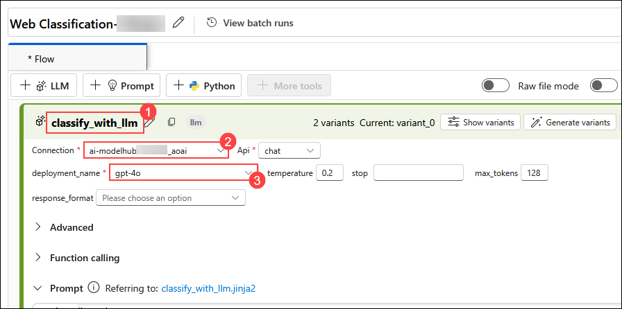
   
1. Replace the existing prompt with the following prompt as a baseline prompt in the **classify_with_llm** node.

   ```
   # system:
   Your task is to classify a given URL into one of the following categories:
   Movie, App, Academic, Channel, Profile, PDF, or None based on the text content information.
   The classification must be based on the URL, the webpage text content summary, or both.
   
   # user:
   The "category" must be one of: Movie, App, Academic, Channel, Profile, PDF,News,Shopping or None.
   The "evidence" must be one of: Url, Text content, or Both.
   
   For a given URL and text content, classify the URL into the appropriate category and indicate the evidence used for classification.
   
   Here are a few examples:
   
   URL: {{ex.url}}
   Text content: {{ex.text_content}}
   
   OUTPUT:
   Use this exact JSON format for your output (no extra text, prefixes, or suffixes):
   {"category": "{{ex.category }}", "evidence": "{{ex.evidence}}"}

   

   For a given URL and text content, classify the url to complete the category and indicate evidence:
   URL: {{url}}
   Text content: {{text_content}}
   OUTPUT:
   ```

      

1. Select the **Show variants** button on the top right of the LLM node. The existing LLM node is variant_0 and is the default variant.

   

1. Select the **Clone** button on **variant_0** to generate variant_1, then we can configure parameters with different values on variant_1.

   
   
1. Scroll down, on the **variant_1** replace the existing prompt with the following prompt:

    ```  
    # system:
    Your task is to categorize a given URL into one of the following types: Movie, App, Academic, Channel, Profile, PDF, or None.
    Use the URL string, the summary of the page content, or both to decide the most appropriate category.
    
    # user:
    The selection range of the value of "category" must be "Movie",  "App", " Academic",  "Channel",  "Profile" , "PDF", "News", "Shopping" or "None".
    The selection range of the value of "evidence" must be within Url, Text content, or Both — depending on what was most helpful in making your classification.
    Given the input below, classify the link and return your answer strictly in valid JSON format.
    Here are a few examples:
    
    URL: {{ex.url}}  
    Text content: {{ex.text_content}}
    
    
    OUTPUT:
    Use this exact JSON format for your output (no extra text, prefixes, or suffixes):  
    {"category": "{{ex.category }}", "evidence": "{{ex.evidence}}"}

    

    For a given URL and text content, classify the url to complete the category and indicate evidence:
    URL: {{url}}
    Text content: {{text_content}}
    OUTPUT:
    ```

    
     
1. Select **Hide variants** to stop adding more variants. All variants are folded. The default variant is shown for the node. For the classify_with_llm node, based on variant_0:

     

1. Scroll up to **summarize_text_content (1)** node and select the following: 

   - Connection: Select the connection **ai-modelhub<inject key="DeploymentID" enableCopy="false"/>_aoai (2)**

   - deployment_name: **gpt-4o (3)**

     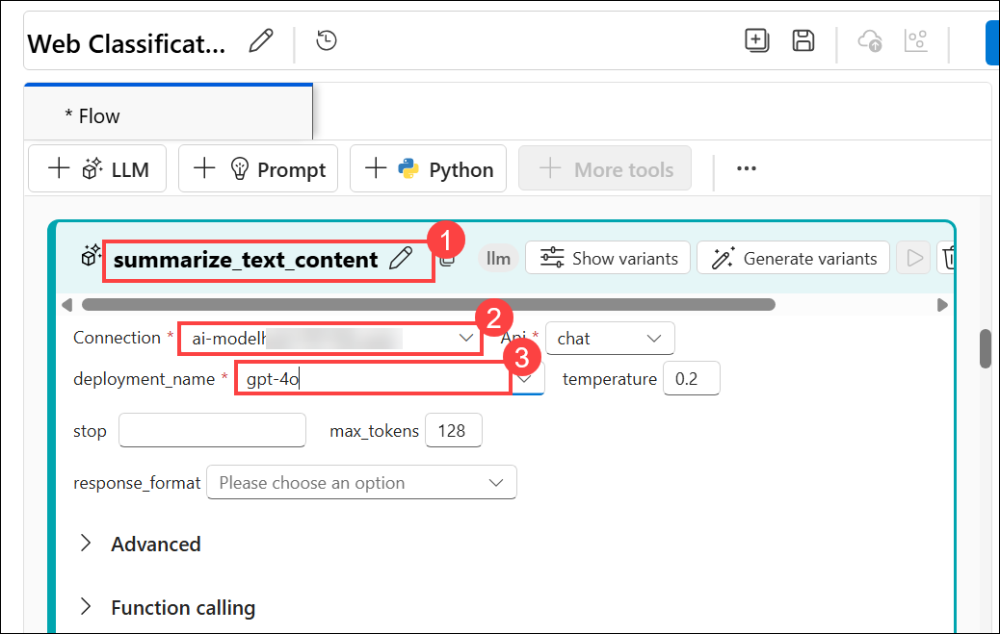

1. Replace the existing prompt with the following prompt as a baseline prompt in the **summarize_text_content** node.  
     
   ```  
   # system:
   Please summarize the following text in one paragraph. 100 words.
   Do not add any information that is not in the text.

   # user:
   Text: The history of the internet dates back to the early 1960s, when the idea of a global network of computers was first proposed. In the late 1960s, the Advanced Research Projects 
   Agency Network (ARPANET) was developed by the United States Department of Defense. It was the first operational packet-switching network and the precursor to the modern internet. The 
   1970s and 1980s saw the development of various protocols and standards, such as TCP/IP, which allowed different networks to communicate with each other. In the 1990s, the invention 
   of the World Wide Web by Tim Berners-Lee revolutionized the internet, making it accessible to the general public. Since then, the internet has grown exponentially, becoming an 
   integral part of daily life for billions of people around the world.

   assistant:
   Summary:
   ```

   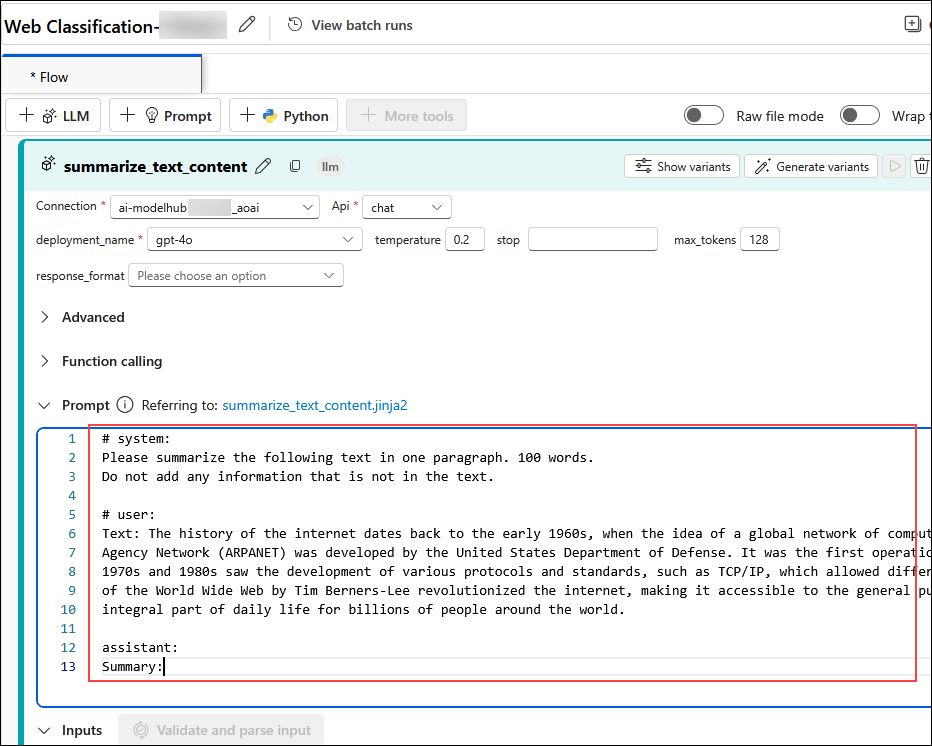

1. Select the **Show variants** button on the top right of the LLM node. The existing LLM node is variant_0 and is the default variant.

    
   
1. Select the **Clone** button on **variant_0** to generate variant_1, then we can configure parameters to different values on variant_1.

   

1. Scroll down, on the **variant_1** replace the existing prompt with the following prompt:

   ```
   # system:
   Please summarize the following text in one paragraph. 100 words.
   Do not add any information that is not in the text.

   # user:
   Text: Artificial intelligence (AI) refers to the simulation of human intelligence in machines that are programmed to think and learn. AI has various applications in today's society, 
   including robotics, natural language processing, and decision-making systems. AI can be categorized into narrow AI, which is designed for specific tasks, and general AI, which can 
   perform any intellectual task that a human can. Despite its benefits, AI also poses ethical concerns, such as privacy invasion and job displacement.

   assistant:
   Summary:

   ```

    

1. Scroll to the last node and click on **+ LLM** present in the top left corner to create a new LLM node.

   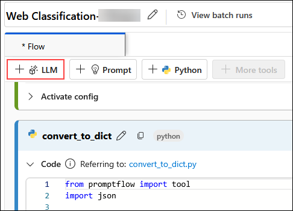

1. Provide the name as **PostProcess (1)** and click on **Add (2)**.

   

1. Once the **PostProcess** node is created, select the following:

   - Connection: Select the connection **ai-modelhub<inject key="DeploymentID" enableCopy="false"/>_aoai (1)**

   - Api: **chat (2)**

   - deployment_name: **gpt-4o (3)**

   - response_format: **{"type":"json_object"}** **(4)**

     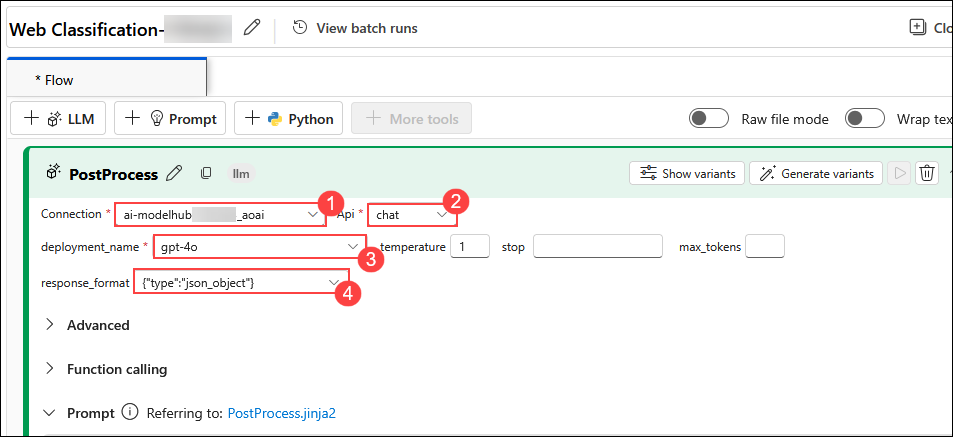

1. Replace the existing prompt with the following **prompt (1)** as a baseline prompt in **PostProcess** node.
   ```
   # system:
   You will provide a properly formed JSON response given an input
   
   The response must follow this sample:
   {
       "category":
       "evidence":(URL,Text content, or Both)
   }
   # user:
   {{input}}
   ```

   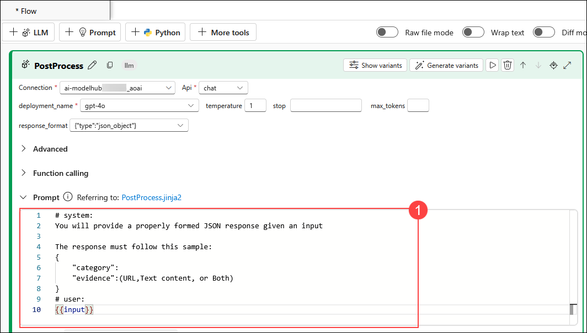

1. Click the **Save (1)** button from the top menu, then select **Start compute session (2)**.

    

     >**Note:** It might take 10-15 minutes to start the session. Wait till the compute session starts.    

1. Click the **Validate and parse input** button **(1)** and For the input value, select **${classify_with_llm.output} (2)** 

   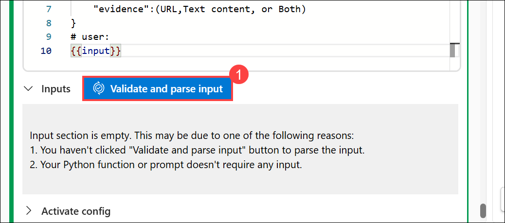

   

1. Finally, click the **Run** button in the top right corner.

    

1. On the Submit flow run window open under **Select the LLM node with variants that you want to run**, choose **Select a node to run variants (1)**, then select **summarize_text_content (2)**, and click on **Submit (3)**. 

   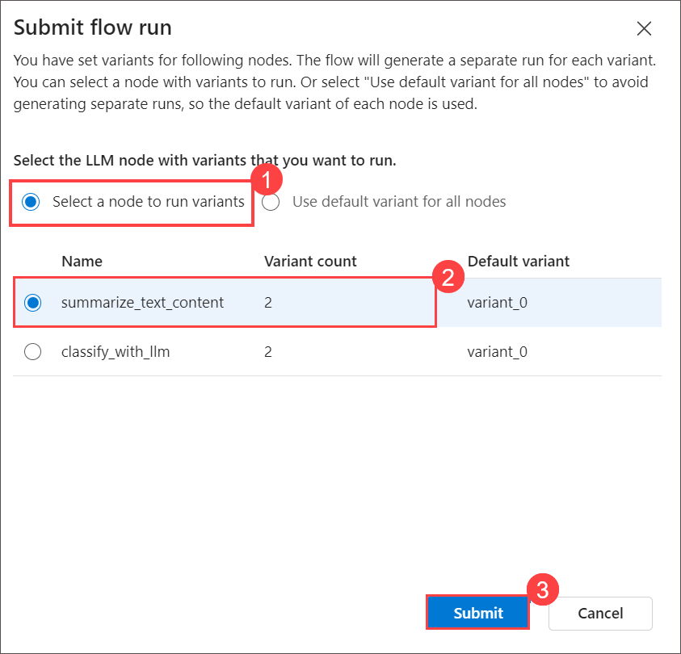
   
1. Once the session runs successfully, review the output by selecting each variant.

1. In top menu select **Variant 0 (1)** from the drop down and select **View full output (2)** for **summarize_text_content** for **variant 0**. Now, review the output of the variant that you selected.

   >**Note:** The output shown in the image may differ in your lab.

   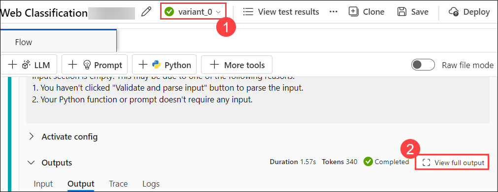

   
  
## Task 2: Optimize Flow Performance for Production 

In this task, you will analyze and refine workflow processes to ensure maximum efficiency and minimal downtime. This includes identifying bottlenecks, applying best practices, and leveraging advanced tools and technologies to streamline operations. You will also implement continuous monitoring and iterative improvements to maintain high performance and adapt to evolving production demands, ultimately enhancing productivity and reducing operational costs.

1. Under **Inputs**, click on **+ Add input (1)**, then add **category** and **text-context** **(2)**. 

    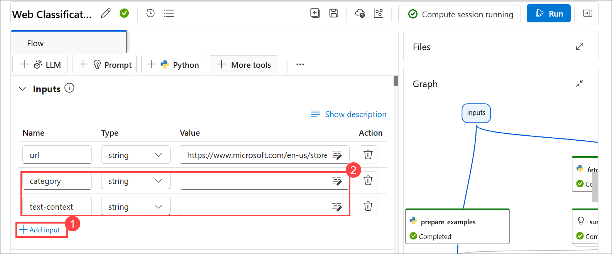

1. Under **Outputs**, click on **+ Add output (1)**, then add **category** and **evidence** **(2)**. Click on **Save (3)**.

    

     >**Note:** In the Output section, if the outputs are already added, please check for the **values** and then select **Save**.
   
1. Select **Evaluate (1)** -> **Custom Evaluation (2)**.

   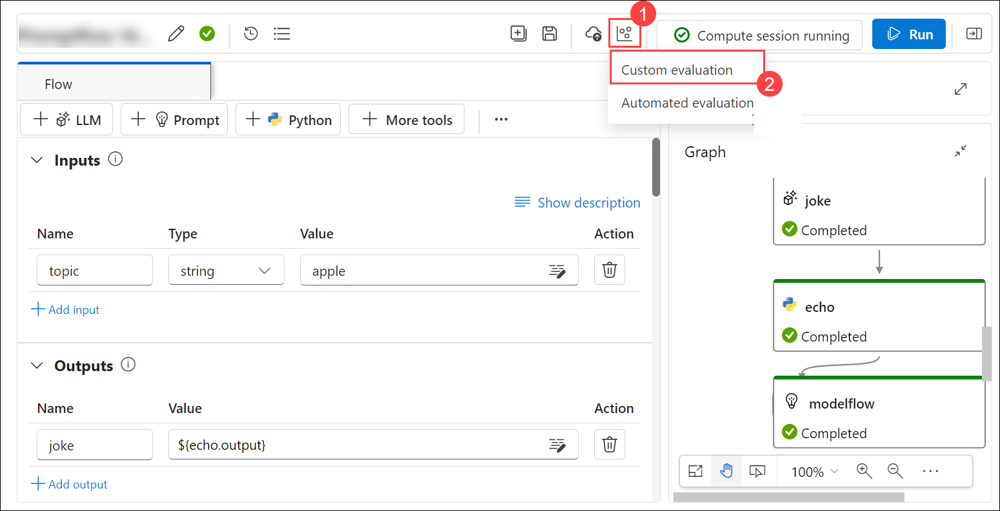

1. On the **Batch run & Evaluate** give **Run display name** as **classify-<inject key="DeploymentID" enableCopy="false"/> (1)**, then under **Variants** select **classify_with_llm (2)**, and click on **Next (3)**.

   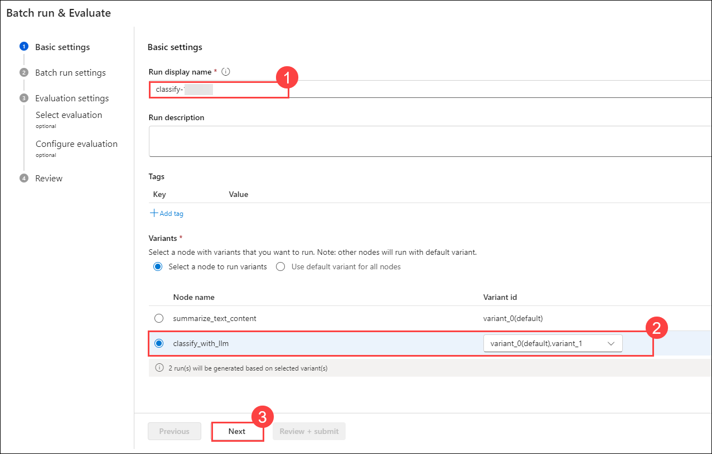

1. On the **Batch run settings** select **+ Add new data**.

   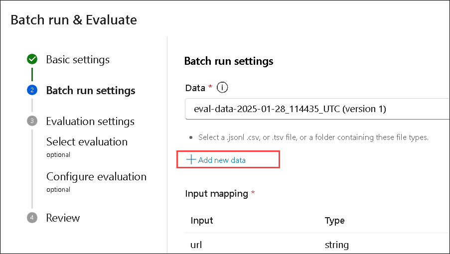

1. On the **Add new data** window open, enter name  **classify_with_llm_data_set (1)** select **Upload from local file (2)** and click on **Browse (3)**.

   

1. Navigate to `C:\LabFiles\Model-Evaluation-and-Model-Tunning\Labs\data` press **Enter** **(1)**, then select **classify.jsonl (2)** file and click on **Open (3)**.

     

1. Click on **Add**.

   

1. Select **${data.text-context} (1)** for **text-context** and click on **Next (2)**.

   
   
1. On the **Select evaluation** page, select **Classification Accuarancy Evaluation (1)** and click on **Next (2)**.

   

1. On the **Configure evaluation** page, expand **Classification Accuracy Evaluation (1)** and select **classify_with_llm_data_set (Version 1) (2)**. For the **groundtruth** data source, select **category (3)** under the **Data input**, and for **prediction**, select **category (4)** under the **Flow output**, then select **Next (5)**.

   

1. On **Review** page review the settings and click on **Submit**.

   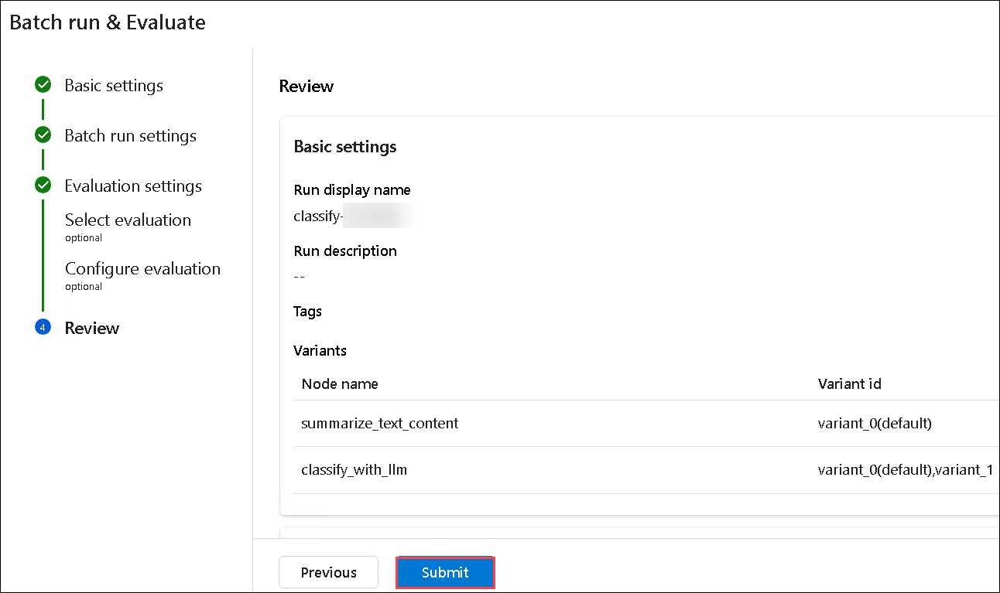

1. Back on the Prompt flow page and from the top, click on the **View run list** link.

   
   
1. After the batch run and evaluation run **complete**, in the run detail page, **multi-select the batch runs for each variant (1)**, then select **Visualize outputs (2)**. You will be able to see the metrics of 2 variants for the classify_with_llm node and LLM, along with predicted outputs for each recorded data.

   

1. After you identify which variant is the best by reviewing the Visualize outputs section, comparing predicted outputs from each variant against the ground truth using metrics like accuracy, F1 score, and precision, you can go back to the flow authoring page, open the classify_with_llm node, click Show variants and set the best performing variant as the default for that node.

1. Now will evaluate the variants of the **summarize_text_content** node as well.

1. Back on the **Prompt flow** page, under the **Input** section, remove all inputs except **url**, then click on **+ Add input (1)** and enter **Text (2)**. 

   

1. Under the **Outputs** section, delete the existing outputs, click on **+ Add output (1)**, then add **Summary** and set the value as **${summarize_text_content.output}**. Also, add **URL** and set the value as **${inputs.url}** **(2)** and then click on **Save (3)**

   

1. Select **Evaluate (1)** and then select **Custom Evaluation (2)**.

   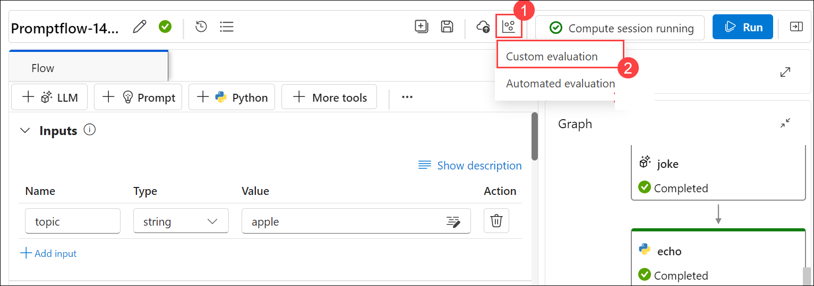

1. On the Batch run & Evaluate give **Run display name** as **summarize_text_content-<inject key="DeploymentID" enableCopy="false"/> (1)**, then under variants select **Use default variants for all nodes (2)**, and select **summarize_text_content (3)** click on **Next (4)**.

   

1. On the **Batch run & Evaluate** screen, under the **Batch run settings** section, click on **+ Add new data** to upload your dataset.

   

1. In the new data window, enter name  **summarize_text_content_data_set (1)** select **Upload from local file (2)** and click on **Browse (3)**.

   

1. Navigate to  `C:\LabFiles\Model-Evaluation-and-Model-Tunning\Labs\data` **(1)**, then select **summarize.jsonl (2)** file  and then click on **Open (3)**.

   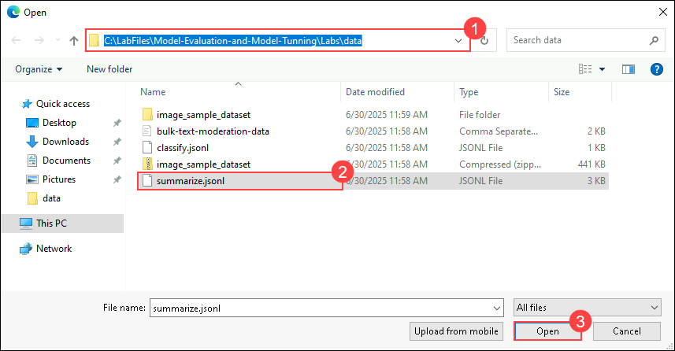

1. Click on **Add**.

   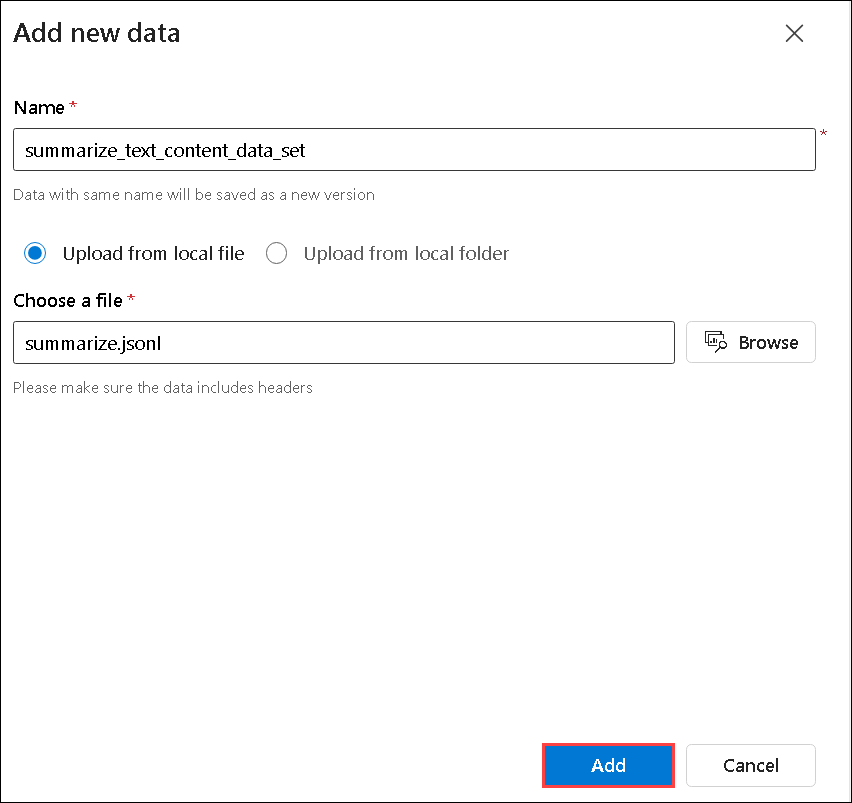

1. Under **Input mapping** for **url** select **${data.text} (1)** and click on **Next (2)**.

   

1. On the **Select evaluation** page select **Classification Accuarancy Evaluation (1)** and click on **Next (2)**.

   

1. On the **Configure evaluation** page, expand **Classification Accuracy Evaluation (1)**, select **summarize_text_content_data_set (Version 1) (2)**, and ensure that the **groundtruth** data source is set to **summary (3)** under the **Data input** section. For **prediction**, select **summary (4)** under the **Flow output**, and then click on **Review + submit (5)**.

    

    >**Note:** If you're not seeing the option for the Dataset column, try changing the data column from `summarize_text_content_data_set` to any other column, and then reselect `summarize_text_content_data_set`. This should refresh the options.

1. On **Review** page review the settings and click on **Submit**.

    

1. Back on the Prompt flow page, and from the top, click on the **View run list** link.

   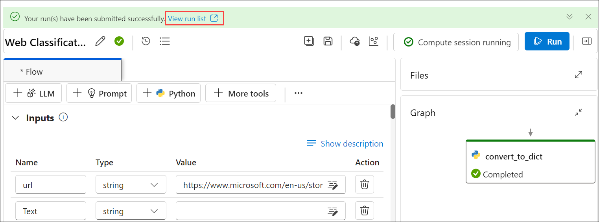
   
1. After the batch run and evaluation run **complete**, in the run detail page, **multi-select (1)** the batch runs for each variant, then select **Visualize outputs (2)**. You will see the metrics of 2 variants for the classify_with_llm node and LLM predicted outputs for each record of data.

   

   > **Note:** If you see any evaluations with name **summarize_text_content-<inject key="DeploymentID" enableCopy="false"/>-Classification Accuracy Evaluation** and displayed as failed, kindly ignore it and proceed further.

1. After you identify which variant is the best by going to the Visualize outputs section, compare the predicted summaries from each variant against the expected summaries using metrics like classification accuracy. Review how closely the AI-generated summaries match the actual ones, and determine which variant performs more consistently. Once the better variant is identified, go back to the flow authoring page, open the summarize_text_content node, click Show variants, and set the best-performing variant as the default for that node.

## Review
In this lab, you have completed the following tasks:
- Performed Iterative Prompt Tuning and Variant Comparison 
- Optimized Flow Performance for Production

### You have successfully completed the lab.
Click on **Next >>** to proceed with the next Lab.


