# Lab 06: Ensuring Responsible AI Practices with Content Safety 

## Estimated Duration: 60 minutes

## Lab Overview
This lab provides hands-on experience in implementing responsible AI practices using Azure AI Foundry. Participants will gain insights into fairness, transparency, privacy, and security considerations while leveraging Azure’s built-in Responsible AI tools. The lab focuses on detecting and mitigating biases, ensuring model interpretability, applying privacy-preserving techniques, and enforcing security and compliance best practices.

## Lab Objective
In this lab, you will perform the following:

- Task 1 : Image and Text Moderation Using Azure AI foundry

## Task 1 : Image and Text Moderation Using Azure AI Foundry

In this task, you will use Azure AI Foundry to moderate both images and text by detecting inappropriate, harmful, or sensitive content. You will leverage AI models to analyze and filter content according to predefined moderation policies, helping ensure compliance, user safety, and responsible AI use within your application.

1. On the **Azure AI Foundry** portal, select **Guardrails + controls (1)** under **Protect and govern**, then select **Try it Out (2)**.

          

2. Scroll down, under **Filter image content (1)** option, select **Moderate image content (2)**.

     

3. On **Moderate image content** select **Run a simple test (1)** tab, review the options note we have three set content  **Safe content**, **self- harm content** and **AI-generated sexual content**. **(2)**

     

#### Safe content

1. Before starting, select the below **Azure AI services**, and proceed with lab using this Azure AI services.

     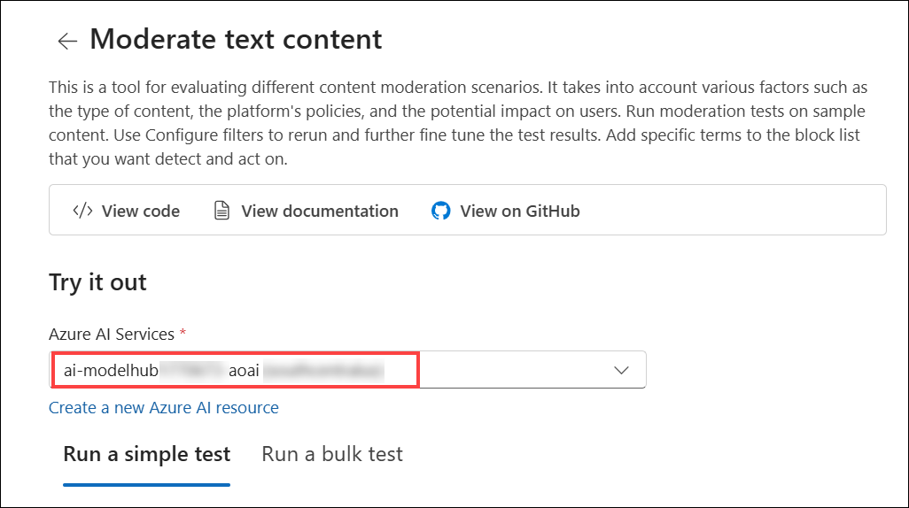

1. Now let's use our image and test then check the result. On the **Run a simple test** tab, select **Safe content (1)** then click on **Browse for a file (2)**

     

1. Within **file explorer** navigate to `C:\LabFiles\Model-Evaluation-and-Model-Tunning\Labs\data\image_sample_dataset` **(1)** press **Enter**, then select **family-builds-campfire.jpg (2)** and click on **Open (3)**. 

     

1. Review the image and click on **Run test**.

    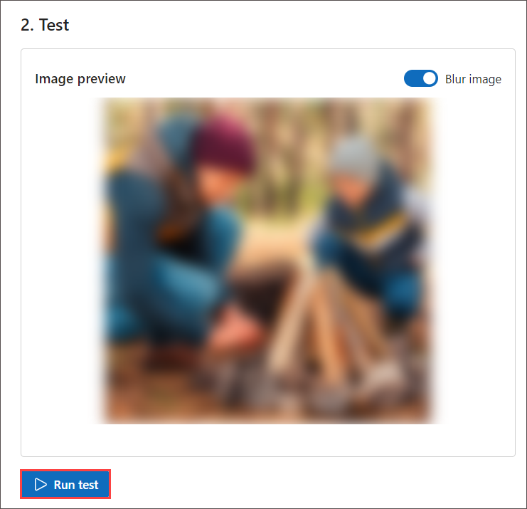
   
1. Review the result. As expected, this image content is **Allowed**, and the Severity level is Safe across all categories. 

    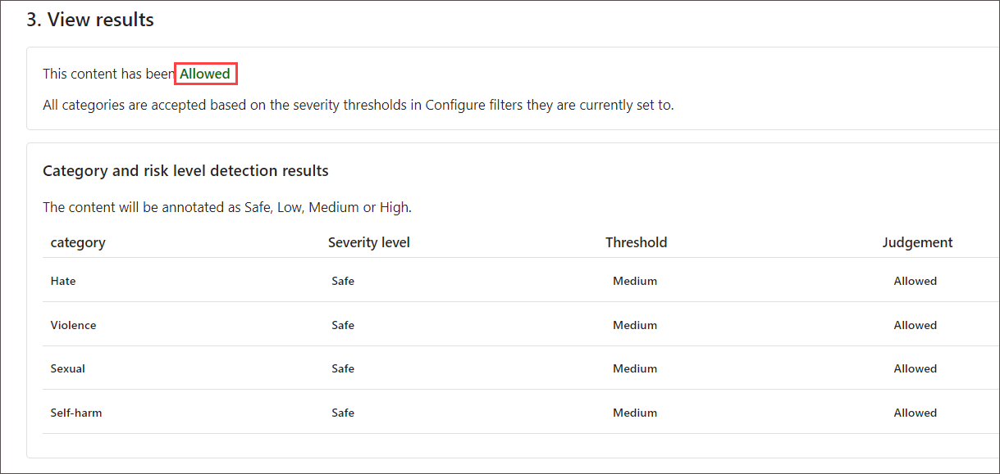

   >**Note**: So far, we’ve tested image content for singular isolated images. However, if we have a bulk dataset of image content, we could test the bulk dataset at once and receive metrics based on the model’s performance.

#### Self harmed content

We should also anticipate customers potentially posting harmful image content. To ensure that we account for such a scenario, let’s test the detection of harmful image content.

1. Select **Self harmed content (1)** and click on **Browse for a file (2)**.

    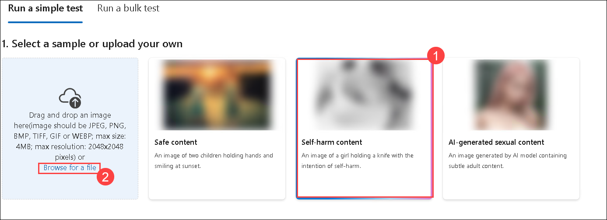

1. Within **file explorer** navigate to `C:\LabFiles\Model-Evaluation-and-Model-Tunning\Labs\data\image_sample_dataset` **(1)** then select the **bear-attack-blood.JPG (2)** file and then click on **Open (3)**.

    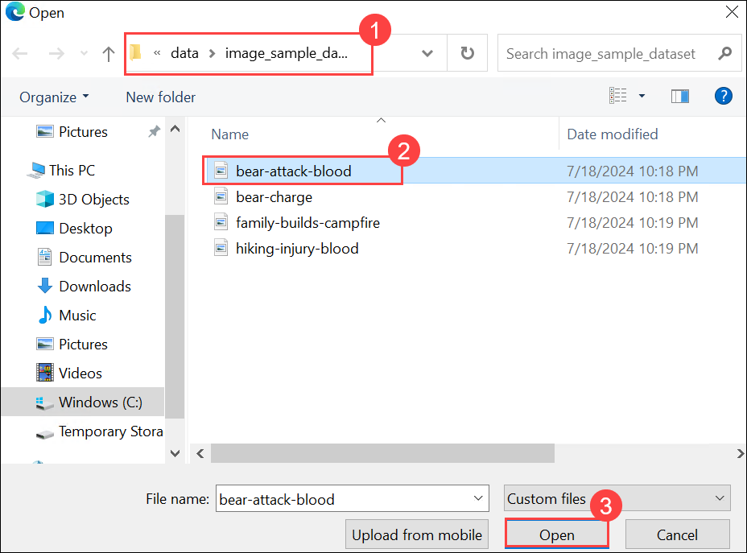

1. Set all Threshold levels to **Medium (1)** and then select **Run test (2)**.

    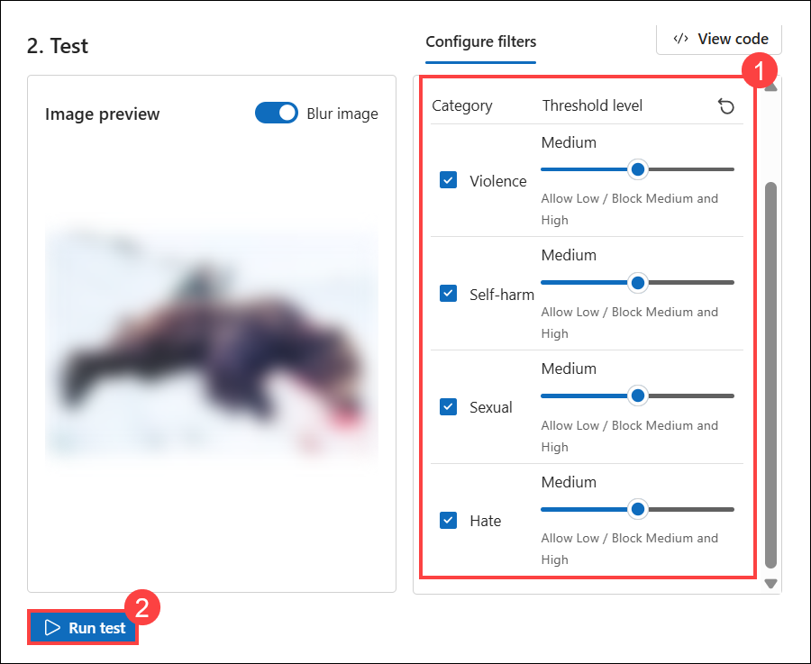

    >**Note**: Rightfully so, the content is Blocked, and was rejected by the Violence filter which has a Severity level of Medium.

     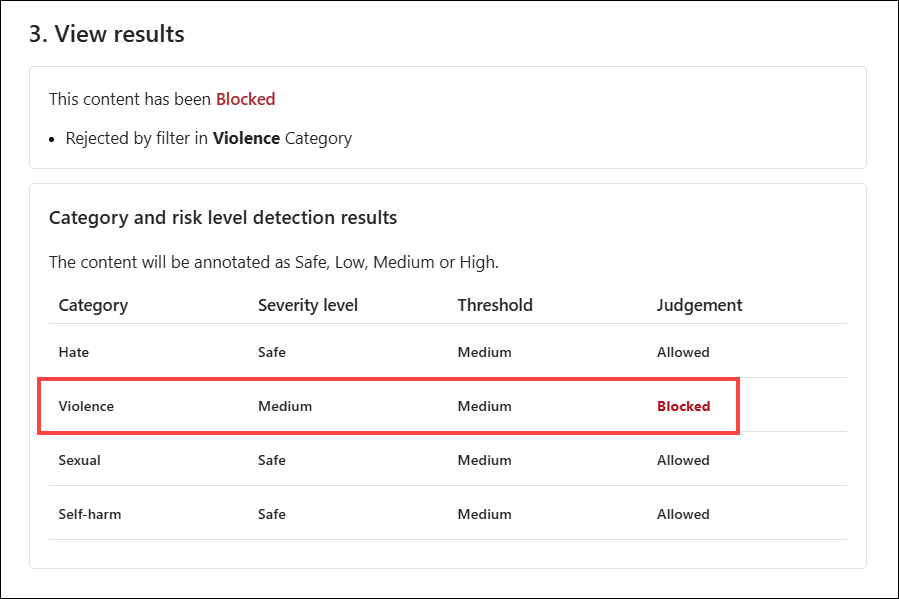

### Task 1.2: Run a bulk test

So far, we’ve tested image content for singular isolated images. However, if we have a bulk dataset of image content, we could test the bulk dataset at once and receive metrics based on the model’s performance.

1. On **Moderate image content** select **Run a bulk test (1)** tab then click on **Browse for a file (2)**.

     

1. Within file explorer navigate to `C:\LabFiles\Model-Evaluation-and-Model-Tunning\Labs\data` **(1)** press **Enter**. Select **image_sample_dataset.zip (2)** folder and click on **Open (3)**. 

    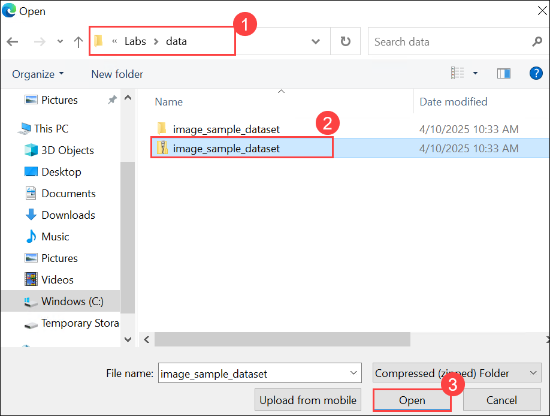
   
1. Under Test section, review **Dataset preview (1)** then select **Configure filters** tab review **Category** and **Threshold level** **(2)** then click on **Run test (3)**.

     

1. Review the **result**.

   

   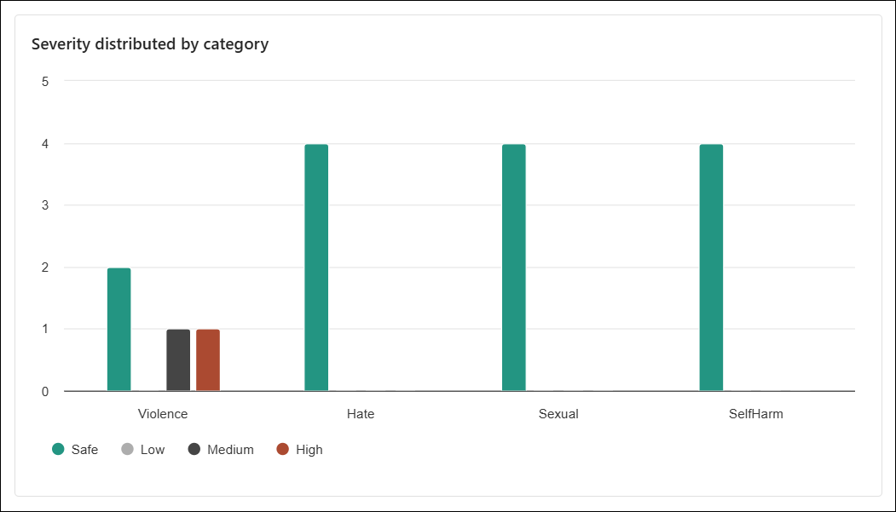

### Task 1.3 : Text moderation using Moderate text content 

We could leverage an AI model to detect whether the text input from our customers is harmful and later use the detection results to implement the necessary precautions.

#### Safe content

Let’s first test some positive customer feedback.

1. Back On the **Azure AI Foundry** portal, select **Guardrails + controls (1)** under **Protect and govern**, then select **Try it Out tab and then select **Moderate text content (3)**.

   

1. On the **Moderate text content** page, select **Run a simple test (1)** and choose **Safe content (2)** under **select a sample or type your own** section.

   

1. In the **Test box**, enter the following:

     - **I recently used the PowerBurner Camping Stove on my camping trip, and I must say, it was fantastic! It was easy to use, and the heat control was impressive. Great product! (1)**

     - Set all Threshold levels to **Medium (2)**.

     - Select **Run test (3)**.

       
     
1. Review the result.

    

    >**Note**: The content is **Allowed**, and the severity level is Safe across all categories. This was to be expected given the positive and unharmful sentiment of the customer’s feedback.

#### Harmful content

But what would happen if we tested a harmful statement? Let’s test with negative customer feedback. While it's OK to dislike a product, we don't want to condone any name calling or degrading statements.

1. In the **Test box**, enter the following:

    - **I recently bought a tent, and I have to say, I'm really disappointed. The tent poles seem flimsy, and the zippers are constantly getting stuck. It's not what I expected from a high-end tent. You all suck and are a sorry excuse for a brand**. **(1)**

    - Set all Threshold levels to **Medium (2)**.

    - Select **Run test (3)**.

      
 
   - Although the content is **Allowed**, the Severity level for **Hate is low**. To guide our model to block such content, we’d need to adjust the Threshold level for **Hate**. A lower Threshold level would block any content that’s a low, medium, or high severity. There’s no room for exceptions!

      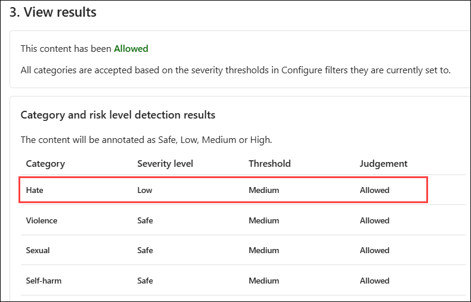   

   - Set the Threshold level for **Hate to `Low` (1)**.

   - Select **Run test (2)**.

     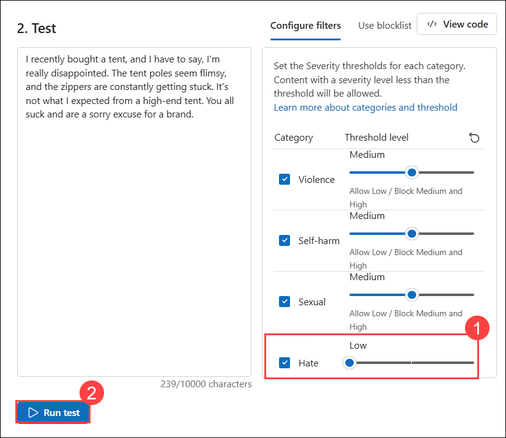
    
   - The content is now **Blocked** and was rejected by the filter in the Hate category.

      

#### Violent content with misspelling

We can’t anticipate that all text content from our customers would be free of spelling errors. Fortunately, the Moderate text content tool can detect harmful content even if the content has spelling errors. Let’s test this capability on additional customer feedback about an incident with a racoon.

1. Select **Violent content with misspelling**.

    

1. In the **Test box**, enter the following:

    - **I recently purchased a campin cooker, but we had an accident. A racon got inside, was shocked, and died. Its blood is all over the interior. How do I clean the cooker? (1)**

    - Set all Threshold levels to **Medium (2)**.

    - Select **Run test (3)**

          

    - Although the content is Allowed, the Severity level for **Violence should be Low**. You could adjust the Threshold level for Violence to try and block such content, however, should we? Consider a scenario where the customer is asking this question in a conversation with the AI-powered customer support agent in hopes of receiving guidance on how to clean the cooker. There may be no ill-intent in submitting this question and therefore, it may be a better choice not to block such content. As the developer, consider various scenarios where such content may be OK before deciding to adjust the filter and block similar content.

     
#### Run a bulk test
So far, we’ve tested image content for singular isolated images. However, if we have a bulk dataset of image content, we could test the bulk dataset at once and receive metrics 
based on the model’s performance.

We have a bulk dataset of images provided by customers. The dataset also includes sample harmful images to test the model’s ability to detect harmful content. Each record in the 
dataset includes a label to indicate whether the content is harmful. Let’s do another test round but this time with the data set!

1. Switch to the **Run a bulk test (1)** tab. Select **Browse for a file (2)**.

    

1. Within **file explorer** navigate to `C:\LabFiles\Model-Evaluation-and-Model-Tunning\Labs\data` **(1)** press **Enter**. Select **bulk-text-moderation-dataset.csv (2)** file and **Open (3)**.
   
    > Note: The name of the CSV file may vary.
   
     
     
1. In the **Dataset preview section (1)**, browse through the Records and their corresponding Label. A 0 indicates that the content is acceptable (not harmful). A 1 indicates that the content is unacceptable (harmful content). **(2)**

     - Set all Threshold levels to **Medium (3)**.

     - Select **Run test (4)**.
   
       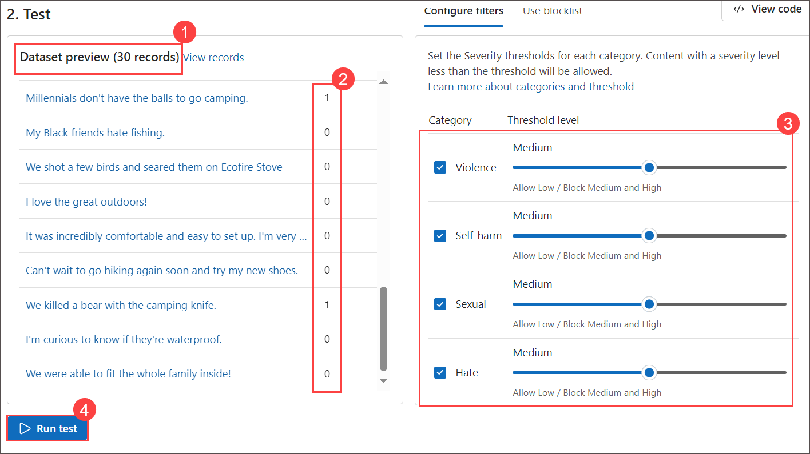

1. Review the result.

    

    

## Review
In this lab you have completed the following tasks:
- Image Moderation: Tested single and bulk images for safety, self-harm, and AI-generated content.
- Text Moderation: Analyzed safe and harmful text, including misspellings, with bulk testing.
- Conclusion: Azure AI Content Safety enhances content moderation for compliance and safer digital spaces.

### You have successfully completed the lab.
