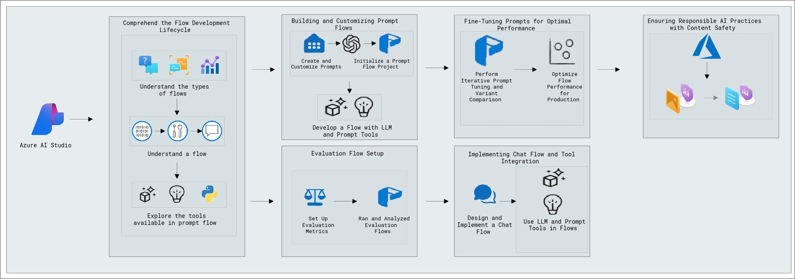
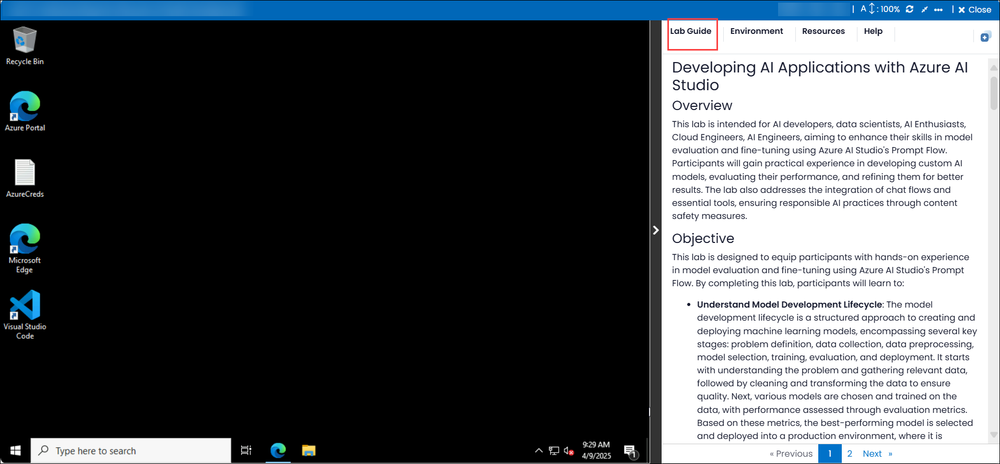
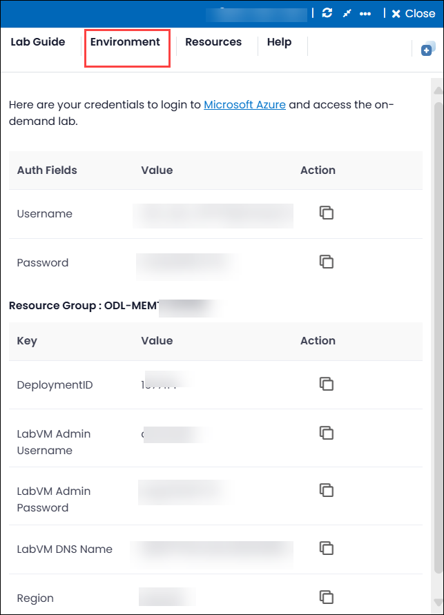
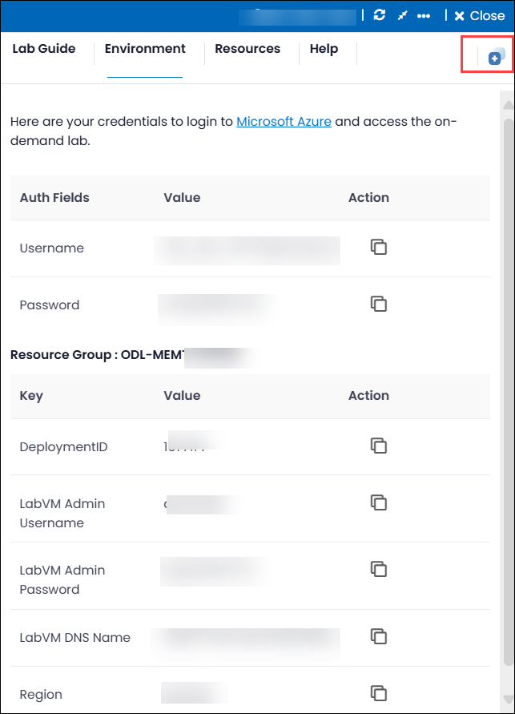
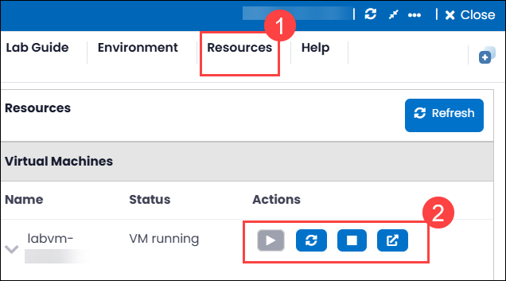
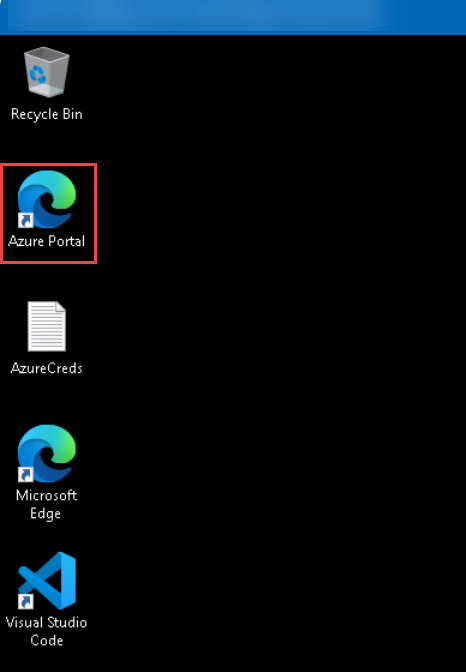
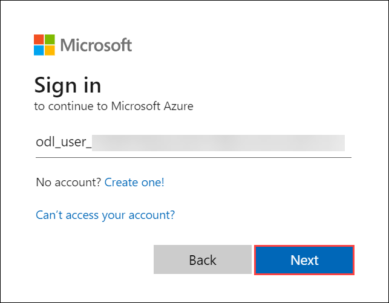
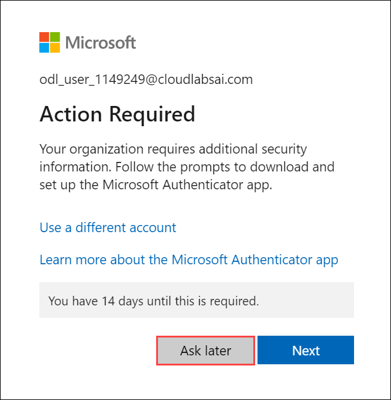

# Developing AI Applications with Azure AI Foundry

## Overall Estimated Duration: 1 Hour

## Overview 

This lab is intended for AI developers, data scientists, cloud engineers, and AI enthusiasts aiming to gain hands-on experience in building, testing, and deploying AI workflows using Azure AI Foundry's Prompt Flow. Participants will learn to initialize Prompt Flow projects, create and customize prompts, and develop flows using LLM and Prompt tools. The lab also guides participants through designing and implementing chat flows, testing them, and deploying them into production. Through practical exercises, participants will explore prompt engineering, monitor flow execution, and integrate custom copilots into real-world applications.

## Objectives 

This lab is designed to equip participants with hands-on experience in building, testing, and deploying AI workflows using Azure AI Foundry's Prompt Flow. By completing this lab, participants will learn to create and refine prompts, develop and monitor flows with LLM tools, and implement chat flows for real-world applications.

- **Initialize a Prompt Flow Project**: ou will learn how to set up a structured Prompt Flow project in Azure AI Foundry by creating a project directory, configuring essential files, and organizing resources to streamline the design, testing, and refinement of prompt-based AI workflows.

- **Create and Customize Prompts**: You will learn how to design and tailor prompts to guide LLMs effectively, aligning them with specific objectives and use cases to enhance the accuracy, relevance, and impact of AI-generated responses.

- **Develop a Flow with LLM and Prompt Tools**: You will learn how to build a flow using LLM and Prompt tools by defining objectives, crafting and refining prompts, and leveraging model outputs to create effective, task-specific AI workflows.

- **Design and Implement a Chat Flow**: You will learn how to create a chat flow using Azure AI Foundry by integrating inputs, configuring LLM nodes, and testing the interaction with a deployed language model to ensure accurate, production-ready responses.

- **Use LLM and Prompt Tools in Flows**: You will learn how to test and validate your developed flow using the chat interface in Azure AI Foundry, leveraging built-in LLM and prompt tools to fine-tune prompts and ensure accurate, context-aware model responses.

## Prerequisites 

Participants should have: 
Basic knowledge and understanding of the following
 
 - Azure Portal
 - Azure AI Foundry

## Architecture 

- **Azure Portal** : The Azure Portal is a unified web-based console that provides a comprehensive interface for managing Azure resources. It allows users to build, manage, and monitor everything from simple web apps to complex cloud applications.
- **Azure AI Foundry** : Azure AI Foundry is a development environment for building, training, and deploying AI models. It provides tools and services to streamline the AI development lifecycle, including data preparation, model training, evaluation, and deployment.

## Architecture Diagram: 

  

## Explanation of Components 

- **Building and Customizing Prompt Flows**: Tailoring interactions enhances user engagement and satisfaction. Fine-tuning flows creates dynamic, responsive experiences that meet specific needs, leading to better outcomes and a personalized touch.

- **Implementing Chat Flow and Tool Integration**: Design, implement, and deploy chat flows, integrating inputs, LLM nodes, and output configurations using Azure AI Foundry.

## Getting Started with the Lab
 
Welcome to your Developing AI Applications with Azure AI Foundry Workshop! We've prepared a seamless environment for you to explore and learn about the connection between creating, evaluating, and fine-tuning AI models using Prompt Flow. You'll develop custom AI models, automate evaluations, fine-tune performance, and integrate chat flows, all while ensuring responsible AI practices with Content Safety Foundry. Let's begin by making the most of this experience:
  
## Accessing Your Lab Environment
 
Once you're ready to dive in, your virtual machine and **lab guide** will be right at your fingertips within your web browser.

### Lab Guide Zoom In/Zoom Out

To adjust the zoom level for the environment page, click the **A↕ : 100%** icon located next to the timer in the lab environment.  

### Virtual Machine & Lab Guide
 
Your virtual machine is your workhorse throughout the workshop. The lab guide is your roadmap to success.
 
### Exploring Your Lab Resources
 
To get a better understanding of your lab resources and credentials, navigate to the **Environment** tab.

 
## Utilizing the Split Window Feature
 
For convenience, you can open the lab guide in a separate window by selecting the **Split Window** button from the Top right corner.

 
## Managing Your Virtual Machine

Feel free to **start, stop, or restart (2)** your virtual machine as needed from the **Resources (2)** tab. Your experience is in your hands!

## Lab Validation

After completing the task, hit the **Validate** button under Validation tab integrated within your lab guide. If you receive a success message, you can proceed to the next task, if not, carefully read the error message and retry the step, following the instructions in the lab guide.

## **Lab Duration Extension**

1. To extend the duration of the lab, kindly click the **Hourglass** icon in the top right corner of the lab environment. 

   

    >**Note:** You will get the **Hourglass** icon when 10 minutes are remaining in the lab.

2. Click **OK** to extend your lab duration.
 
    

3. If you have not extended the duration prior to when the lab is about to end, a pop-up will appear, giving you the option to extend. Click **OK** to proceed. 

## Let's Get Started with Azure Portal

1. On your virtual machine, click on the **Azure Portal** icon as shown below:

   
   
1. You'll see the **Sign into Microsoft Azure** tab. Here, enter your credentials:
 
   - **Email/Username:** <inject key="AzureAdUserEmail"></inject>
 
       
 
1. Next, provide your password:
 
   - **Password:** <inject key="AzureAdUserPassword"></inject>
 
       

1. If **Action required** pop-up window appears, click on **Ask later**.

   
    
1. If prompted to stay signed in, you can click **No**.
 
1. If a **Welcome to Microsoft Azure** pop-up window appears, simply click **Cancel** to skip the tour.

## Steps to Proceed with MFA Setup if the "Ask Later" Option is Not Visible

1. If you see the pop-up **Stay Signed in?**, click **No**.

1. If **Action required** pop-up window appears, click on **Next**.
   
   

1. On **Start by getting the app** page, click on **Next**.
1. Click on **Next** twice.
1. In **android**, go to the play store and Search for **Microsoft Authenticator** and Tap on **Install**.

   

   > Note: For Ios, Open the app store and repeat the steps.

   > Note: Skip if already installed.

1. Open the app and tap on **Scan a QR code**.

1. Scan the QR code visible on the screen **(1)** and click on **Next (2)**.

   

1. Enter the digit displayed on the Screen in the Authenticator app on mobile and tap on **Yes**.

1. Once the notification is approved, click on **Next**.

   

1. Click on **Done**.

1. If prompted to stay signed in, you can click **"No"**.

1. Tap on **Finish** in the Mobile Device.

   > NOTE: While logging in again, enter the digits displayed on the screen in the **Authenticator app** and click on Yes.

1. If a **Welcome to Microsoft Azure** pop-up window appears, simply click **"Cancel"** to skip the tour.

1. If you see the pop-up **You have free Azure Advisor recommendations!**, close the window to continue the lab.

## **Support Contact**

1. The CloudLabs support team is available 24/7, 365 days a year, via email and live chat to ensure seamless assistance at any time. We offer dedicated support channels tailored specifically for both learners and instructors, ensuring that all your needs are promptly and efficiently addressed.

   Learner Support Contacts:

    - Email Support: cloudlabs-support@spektrasystems.com
    - Live Chat Support: https://cloudlabs.ai/labs-support

2. Now, click on **Next** from the lower right corner to move on to the next page.

   
 
### Happy Learning!!

