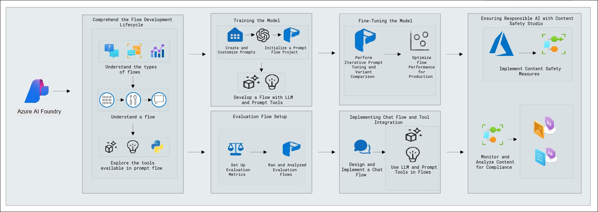
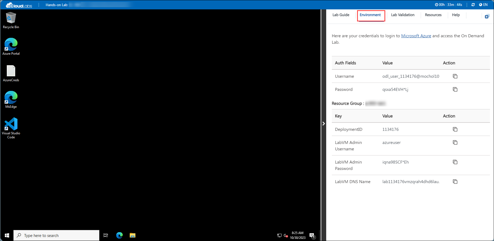

# Developing AI Applications with Azure AI Foundry

## Overview 

This lab is intended for AI developers, data scientists, AI Enthusiasts, Cloud Engineers, AI Engineers, aiming to enhance their skills in model evaluation and fine-tuning using Azure AI Foundry Prompt Flow. Participants will gain practical experience in developing custom AI models, evaluating their performance, and refining them for better results. The lab also addresses the integration of chat flows and essential tools, ensuring responsible AI practices through content safety measures.

## Objective 

This lab is designed to equip participants with hands-on experience in model evaluation and fine-tuning using Azure AI Foundry Prompt Flow. By completing this lab, participants will learn to: 

- **Understand Model Development Lifecycle**: The model development lifecycle is a structured approach to creating and deploying machine learning models, encompassing several key stages: problem definition, data collection, data preprocessing, model selection, training, evaluation, and deployment. It starts with understanding the problem and gathering relevant data, followed by cleaning and transforming the data to ensure quality. Next, various models are chosen and trained on the data, with performance assessed through evaluation metrics. Based on these metrics, the best-performing model is selected and deployed into a production environment, where it is monitored and maintained to ensure continued accuracy and relevance. This lifecycle ensures a systematic approach to building effective machine learning solutions.

- **Create and Train Models**: Creating and training models involves developing a machine learning or statistical model by first defining its structure and then training it using data. This process typically starts with selecting an appropriate algorithm based on the problem, such as regression, classification, or clustering. Once the model is chosen, it is initialized and trained on a dataset by feeding it input features and corresponding target values. During training, the model adjusts its parameters to minimize errors or maximize performance metrics. After training, the model is evaluated using separate validation data to assess its accuracy and generalizability. Fine-tuning and adjustments may be necessary to improve performance before deploying the model for real-world use.

- **Set Up and Automate Evaluations**: Setting up and automating evaluations involves creating a structured process to assess performance, skills, or outcomes efficiently. This typically includes defining evaluation criteria, designing assessment tools, and configuring automation software to streamline data collection and analysis. The goal is to ensure consistent and objective evaluations by reducing manual effort and minimizing human error. Automation can include scheduling regular evaluations, generating reports, and tracking progress over time, making the process more effective and scalable for organizations or educational institutions.

- **Fine-Tune Models**: Fine-tuning models involves adjusting a pre-trained machine learning model on a new, often smaller, dataset to improve its performance for a specific task. This process leverages the general knowledge the model has already acquired from a broader dataset and refines it to make the model more effective for the particular nuances of the new dataset. Fine-tuning typically requires fewer resources and less data compared to training a model from scratch, making it a cost-effective way to adapt powerful models to specialized applications.

- **Implement and Test Chat Flows**: Implementing and testing chat flows involves creating and evaluating the interactions between a user and a chatbot or automated messaging system. This process begins with designing the conversation paths, including potential user inputs and corresponding system responses, to ensure that the chatbot can effectively address various scenarios. After implementation, thorough testing is conducted to identify and rectify any issues, ensuring the chat flow is intuitive, accurate, and capable of handling diverse user interactions. The goal is to deliver a seamless and efficient user experience, refining the chat flow based on test results to improve functionality and user satisfaction.

- **Ensure Responsible AI Practices**: Ensuring responsible AI practices involves implementing ethical guidelines and standards that govern the development and deployment of artificial intelligence systems. This includes prioritizing transparency, accountability, and fairness in AI algorithms, ensuring they do not perpetuate biases or cause harm. Organizations must also focus on safeguarding privacy, securing data, and fostering an inclusive approach that considers the broader societal impacts of AI technologies. Regular audits, adherence to legal and ethical norms, and stakeholder engagement are crucial to maintaining trust and promoting the responsible use of AI.

## Prerequisites 

Participants should have: 
Basic knowledge and understanding of the following
 
 - Azure Portal
 - Azure AI Foundry
 - Content Safety Studio

## Architecture 

- **Azure Portal** : The Azure Portal is a unified web-based console that provides a comprehensive interface for managing Azure resources. It allows users to build, manage, and monitor everything from simple web apps to complex cloud applications.
- **Azure AI Foundry** : Azure AI Foundry is a development environment for building, training, and deploying AI models. It provides tools and services to streamline the AI development lifecycle, including data preparation, model training, evaluation, and deployment.
- **Content Safety Studio** : Content Safety Studio is a suite of tools within Azure that provides capabilities for moderating and filtering content to ensure it meets safety and compliance standards. It includes text moderation and image moderation services.

## Architecture Diagram: 

  

## Explanation of Components 

- **Understanding the Lifecycle of Model Development**:
   - **Prompt Flow Stages**: Learn the stages of AI application development, including initialization, experimentation, evaluation, refinement, and production.
   - **Flow Types**: Understand different types of flows (Standard, Chat, Evaluation) within Azure AI Foundry.

- **Training the Model**: Create, configure, and run flows using Prompt and Large Language Model (LLM) tools in Azure AI Foundry.
- **Evaluation Flow Setup**: Set up evaluation flows to automate model performance assessment using metrics like coherence and fluency.
- **Fine-Tuning the Model**: Fine-tune models through iterative prompt tuning, variant comparison, and performance optimization to enhance accuracy and efficiency.
- **Implementing Chat Flow and Tool Integration**: Design, implement, and deploy chat flows, integrating inputs, LLM nodes, and output configurations using Azure AI Foundry.
- **Ensuring Responsible AI with Content Safety Studio**: Utilize Text Moderation to filter harmful text and Image Moderation to block unsafe images, ensuring safe and appropriate user-generated content.

## Getting Started with the Lab
 
Welcome to your Developing AI Applications with Azure AI Foundry Workshop! We've prepared a seamless environment for you to explore and learn about the connection between creating, evaluating, and fine-tuning AI models using Prompt Flow. You'll develop custom AI models, automate evaluations, fine-tune performance, and integrate chat flows, all while ensuring responsible AI practices with Content Safety Studio. Let's begin by making the most of this experience:
 
## Accessing Your Lab Environment
 
1. Once you're ready to dive in, your virtual machine and lab guide will be right at your fingertips within your web browser.

     

 ### Virtual Machine & Lab Guide
 
   Your virtual machine is your workhorse throughout the workshop. The lab guide is your roadmap to success.
 
## Exploring Your Lab Resources
 
1. To get a better understanding of your lab resources and credentials, navigate to the **Environment** tab.

 
   
 
## Utilizing the Split Window Feature
 
1. For convenience, you can open the lab guide in a separate window by selecting the **Split Window** button from the Top right corner.

   
 
## Managing Your Virtual Machine

1. Feel free to start, stop, or restart your virtual machine as needed from the **Resources** tab. Your experience is in your hands!

   

## Lab Guide Zoom In/Zoom Out

1. To adjust the zoom level for the environment page, click the **A↕ : 100%** icon located next to the timer in the lab environment.

   

## **Lab Duration Extension**

1. To extend the duration of the lab, kindly click the **Hourglass** icon in the top right corner of the lab environment. 

   

    >**Note:** You will get the **Hourglass** icon when 10 minutes are remaining in the lab.

2. Click **OK** to extend your lab duration.
 
    

3. If you have not extended the duration prior to when the lab is about to end, a pop-up will appear, giving you the option to extend. Click **OK** to proceed. 

## **Support Contact**

1. The CloudLabs support team is available 24/7, 365 days a year, via email and live chat to ensure seamless assistance at any time. We offer dedicated support channels tailored specifically for both learners and instructors, ensuring that all your needs are promptly and efficiently addressed.

   Learner Support Contacts:

    - Email Support: cloudlabs-support@spektrasystems.com
    - Live Chat Support: https://cloudlabs.ai/labs-support

2. Now, click on Next from the lower right corner to move on to the next page.
 
### Happy Learning!!
