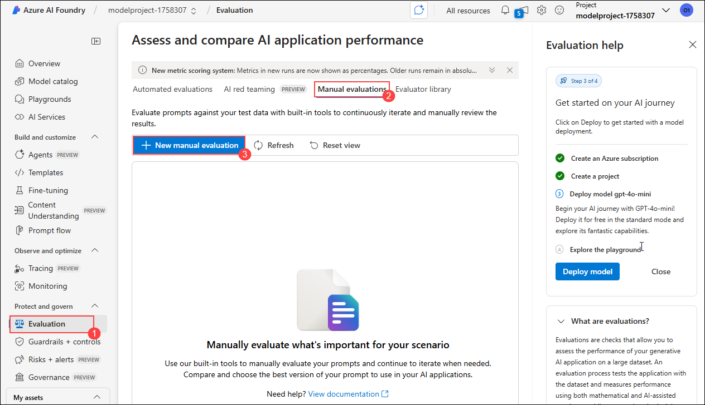
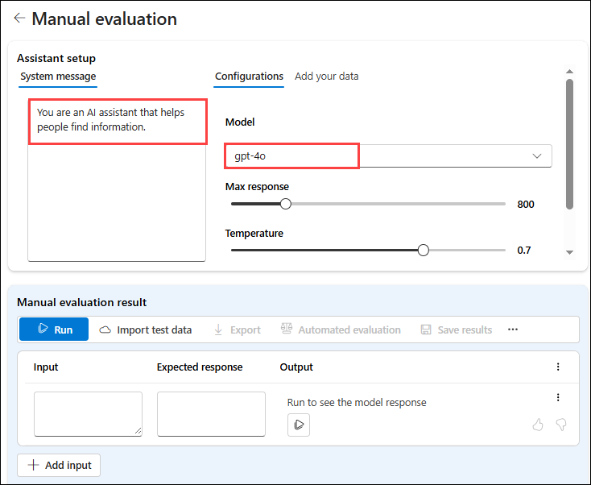
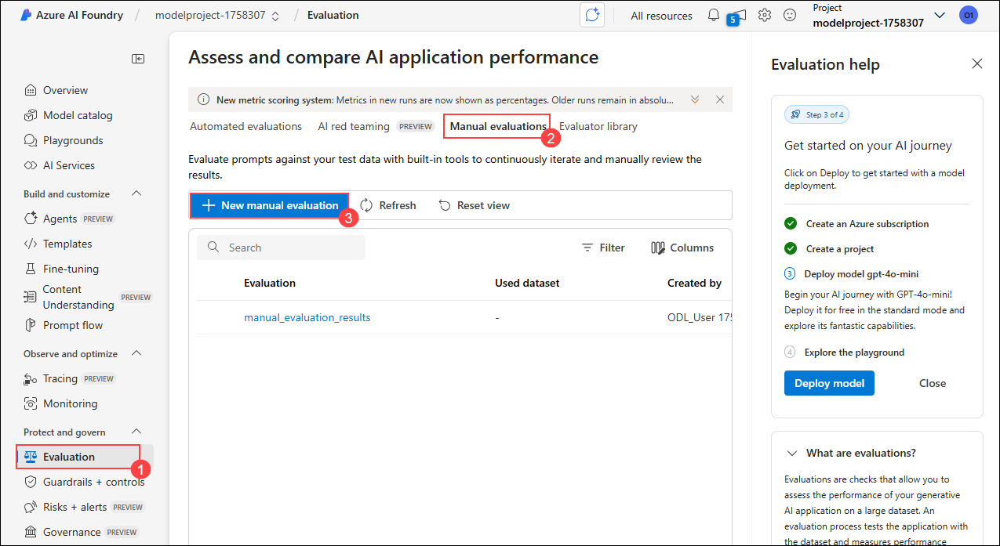
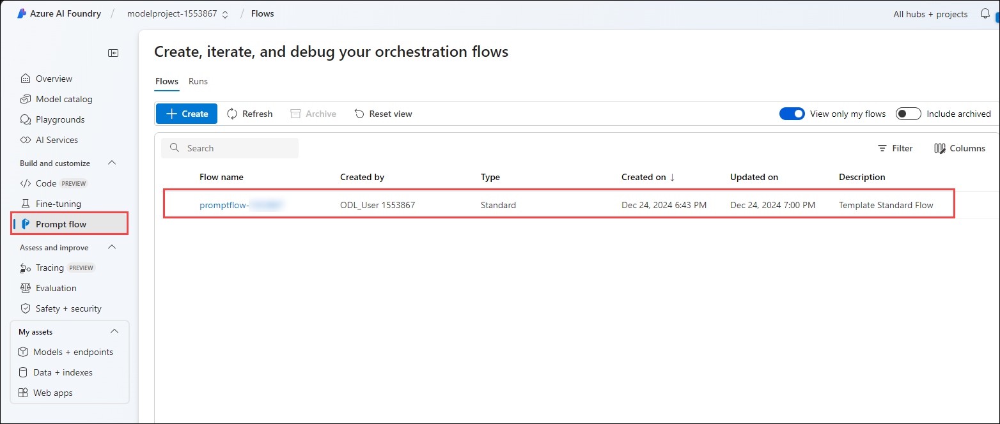
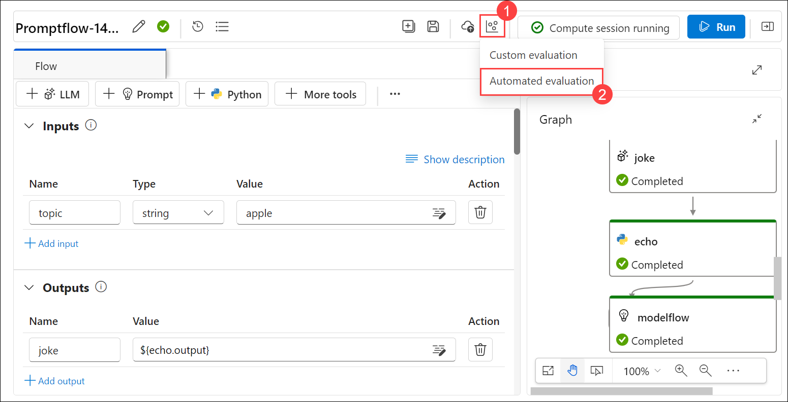
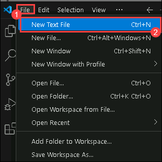
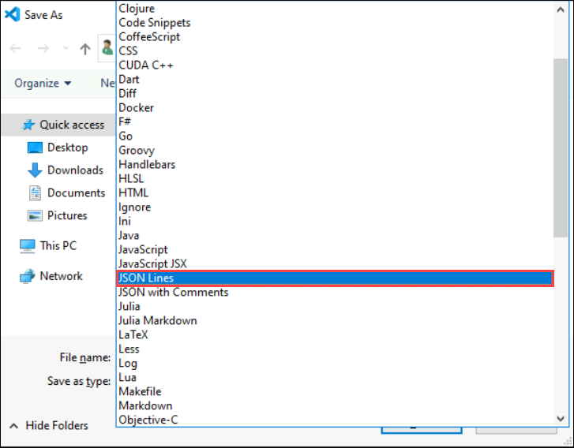
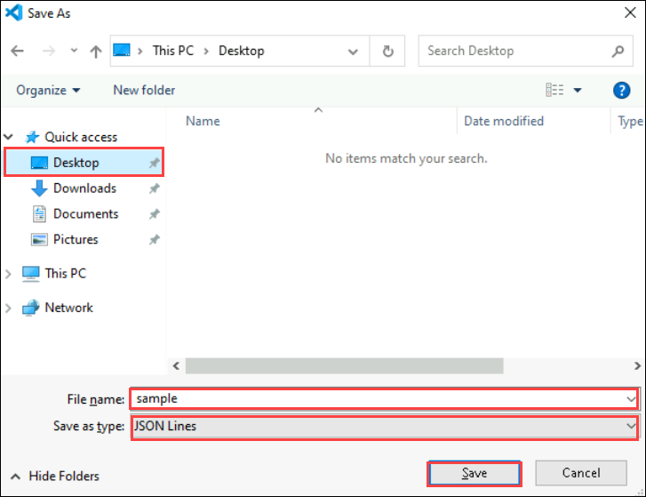

# Lab 02: Evaluation Flow Setup

### Estimated Duration: 30 Minutes

## Lab scenario
In this lab, you will set up and analyze evaluation flows for an AI model using Azure AI Foundry. You will manually review model responses to various inputs, providing a detailed evaluation of the model's performance. By setting up specific evaluation metrics, such as coherence and fluency, you will automate the evaluation process using a provided dataset. This hands-on experience will help you understand how to critically assess and refine AI model outputs, ensuring the model meets desired performance standards.

## Lab objectives
In this lab, you will perform the following:
- Task 1: Set Up Evaluation Metrics
- Task 2: Run and Analyze Evaluation Flows

## Task 1: Set Up Evaluation Metrics

You can manually review model responses based on test data. Manually reviewing allows you to test different inputs one at a time to evaluate whether the model performs as expected.

1. From the left navigation menu, under the **Access and Improve** section, select **Evaluation (1)**. On the **Assess and compare AI application performance** select **Manual evaluations (2)** tab. Select **+ New manual evaluation (3)**.

    

1. A new window opens with your previous system message already populated and your deployed model selected.

   

1. In the **Manual evaluation result** section, you'll add five inputs for which you will review the output. Enter the following five questions as five separate inputs by selecting **+ Add Inputs**:

   `Can you provide a list of the top-rated budget hotels in Rome?`

   `I'm looking for a vegan-friendly restaurant in New York City. Can you help?`

   `Can you suggest a 7-day itinerary for a family vacation in Orlando, Florida?`

   `Can you help me plan a surprise honeymoon trip to the Maldives?`

   `Are there any guided tours available for the Great Wall of China?`

1. Select **Run** from the top bar to generate outputs for all questions you added as inputs.

    

1. You can now manually review the outputs for each question by selecting the thumbs up or down icon at the bottom right of a response. Rate each response, ensuring you include at least one thumbs up and one thumbs down response in your ratings.

   .png)

1. Select **Save results** from the top bar. Enter **manual_evaluation_results** as the name for the results, and select **Save**.

   
   
1. Using the menu on the left, navigate to **Evaluations**.

1. Select the **Manual evaluations** tab to find the manual evaluations you just saved. Note that you can explore your previously created manual evaluations, continue where you left of, and save the updated evaluations.

    

## Task 2: Run and Analyze Evaluation Flows

It systematically assesses the performance and effectiveness of various processes and systems. This involves executing evaluation workflows, collecting data, and thoroughly analyzing the results to identify strengths and weaknesses. By leveraging detailed insights from these analyses, organizations can make informed decisions, implement improvements, and optimize their operations. Continuous evaluation ensures that processes remain efficient, effective, and aligned with organizational goals, ultimately enhancing overall performance and productivity.

1. Select **Prompt flow** from left navigation pane and select the prompt flow you created.

   

1. From the top menu bar select **Evaluate (1)** the from the drop down select **Automated Evaluation (2)**.

   

1. On create a new evaluation, Select **Evalutae an existing query-response dataset**, and click on **Next**.

    - Open a new tab and paste the new link **https://raw.githubusercontent.com/MicrosoftLearning/mslearn-ai-studio/main/data/travel-qa.jsonl** JSONL file. press **Ctrl A** 
      and **Ctrl C** to select all and **Copy**.
  
    - Search for Visual Studio in the Windows search bar of the vm and open it.

       

    - From the **File (1)** menu, select **New Text File (2)**, paste the copied code.

       

    - Provide the name as `sample` and save it as **JSON Lines** file on your desktop.
  
       

       
   
1. Navigate back to **Azure AI foundry**, where you were **creating a new evaluation**.
   - **Configure test data**: select **Upload new dataset**, then select the file that you downloaded earlier in this task **(sample.jsonl)**.
   - **Configure Evaluators**: Click on **+ Add** and select **Likert-scale evaluator**.
   - Provide the name as **Coherence** (1) for Criteria Name, **Coherence** (2) for presets, scroll down and select **{{item.query}}** (3) for query, select **{{item.response}}** (4) for Response and click on **Add (5)**.
   - *Configure Evaluators*: Click on *+ Add* and select *Likert-scale evaluator*.
   - Provide the name as **Fluency** (1) for Criteria Name, **Fluency** (2) for presets, scroll down and select **{{item.query}}** (3) for query, select **{{item.response}}** (4) for Response and click on **Add** (5).
   - Once added, click on **Next**.
   - Now, update model evaluation name to **Modelevaluation-<inject key="DeploymentID"></inject>** (1) and click on **Submit** (2)
1. Wait until the evaluation status changes to **Completed**. If the status shows **Queued** or **Running**, you may need to refresh the page to see the latest update.
1. Select **Evaluation** (1) from the left navigation menu, and under **Automated Evaluation** (2), choose the newly created evaluation run (3).
1. Under the **Report** tab, scroll down to explore the **Metric dashboard**.
1. Navigate to **Data** (1) tab from the top menu to view the **Detailed metrics results** (2).

## Review

In this lab you have completed the following tasks:
- Set Up Evaluation Metrics
- Ran and Analyzed Evaluation Flows

### You have successfully completed the lab.
